# Домашнее задание к занятию 1 «Введение в Ansible»

## Основная часть

### 1

```bash
cd playbook/
ansible-playbook -i inventory/test.yml site.yml
```
some_fact = 12

<details>
<summary>Скриншот</summary>

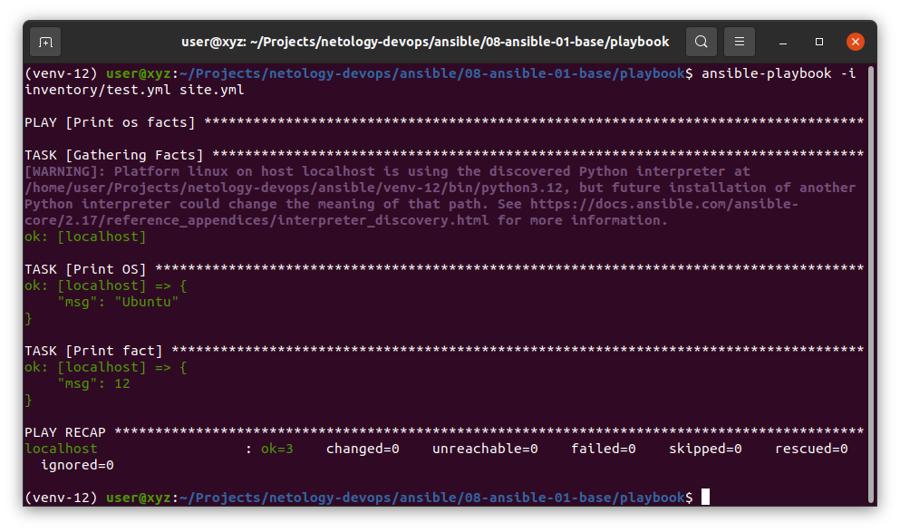
</details>

### 2

<details>
<summary>Скриншот</summary>

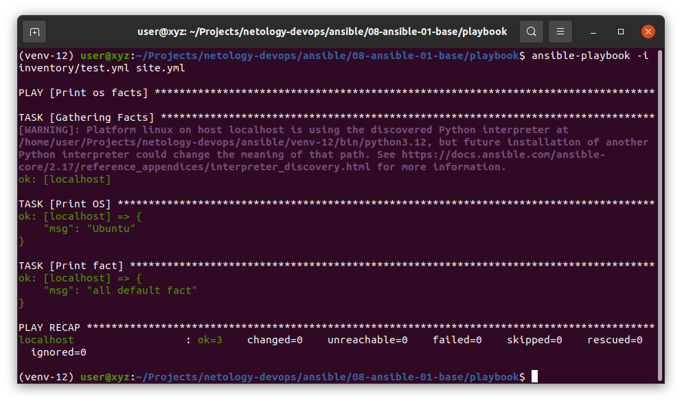
</details>

### 3

<details>
<summary>Ubuntu image</summary>

`ubuntu/python:3.12-24.04_edge` из репозитория [ubuntu/python](https://hub.docker.com/r/ubuntu/python) не содержит `bash` или `sh`, поэтому, а возможно и по какой-либо другой причине, `ansible` не может подключиться к контейнеру.
</details>

<details>
<summary>Commands</summary>

```bash
# from ansible/08-ansible-01-base directory
docker compose up -d
ansible-playbook -i playbook/inventory/prod.yml playbook/site.yml
docker compose down
```
Чтобы подавить предупреждения об открытых (`discovered`) интерпретаторах `Python`:
```bash
export ANSIBLE_PYTHON_INTERPRETER=auto_silent
```
</details>

### 4

<details>
<summary>Скриншоты</summary>

* Запуск с `network_mode: host`
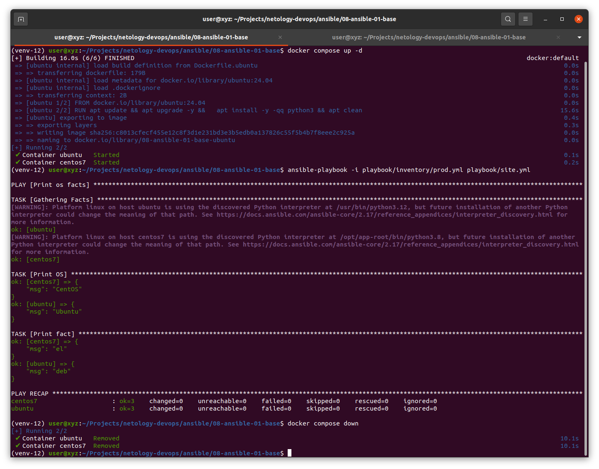
* Запуск с `bridged network`
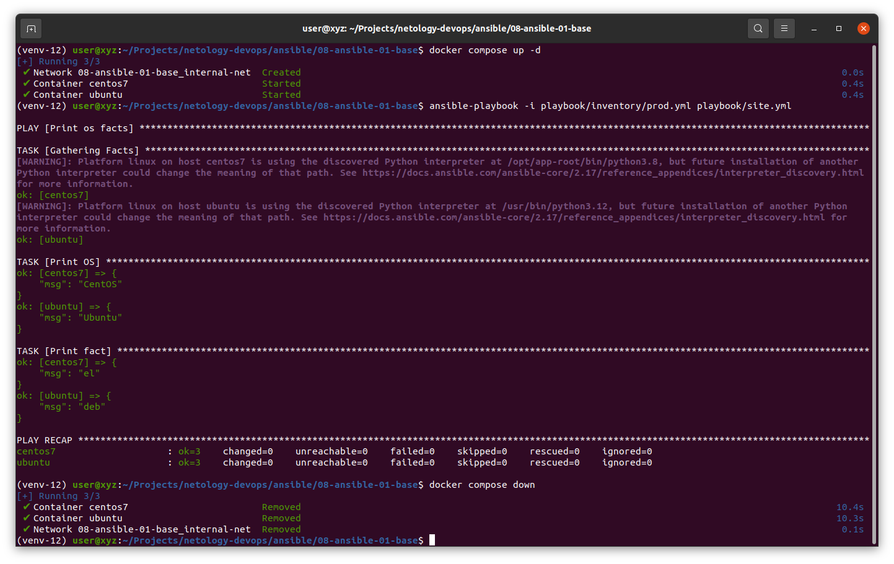
</details>

some_fact:
* centos7 => `el`
* ubuntu => `deb`

### 5+6

<details>
<summary>Скриншот</summary>

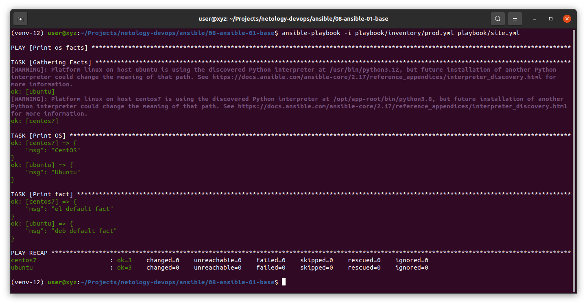
</details>

### 7+8

<details>
<summary>Commands</summary>

```bash
ansible-vault encrypt playbook/group_vars/{deb,el}/examp.yml
ansible-playbook --ask-vault-pass -i playbook/inventory/prod.yml playbook/site.yml
# ansible-vault view playbook/group_vars/{deb,el}/examp.yml
# ansible-vault edit playbook/group_vars/{deb,el}/examp.yml
# ansible-vault decrypt playbook/group_vars/{deb,el}/examp.yml
# ansible-vault encrypt_string 
```
</details>

<details>
<summary>Скриншот</summary>

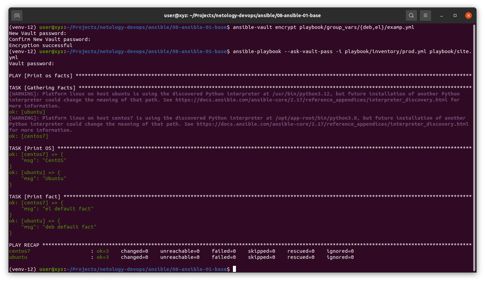
</details>

### 9.

```bash
ansible-doc --type connection --list | grep control
# => ansible.builtin.local
```

<details>
<summary>Скриншот</summary>

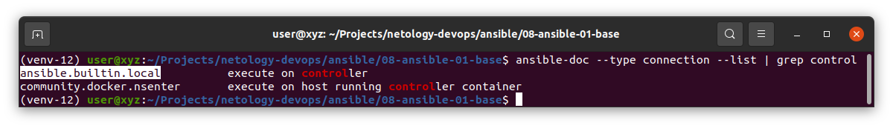
</details>

### 10+11.

```bash
ansible-playbook --ask-vault-pass -i playbook/inventory/prod.yml playbook/site.yml
```

<details>
<summary>Скриншот</summary>

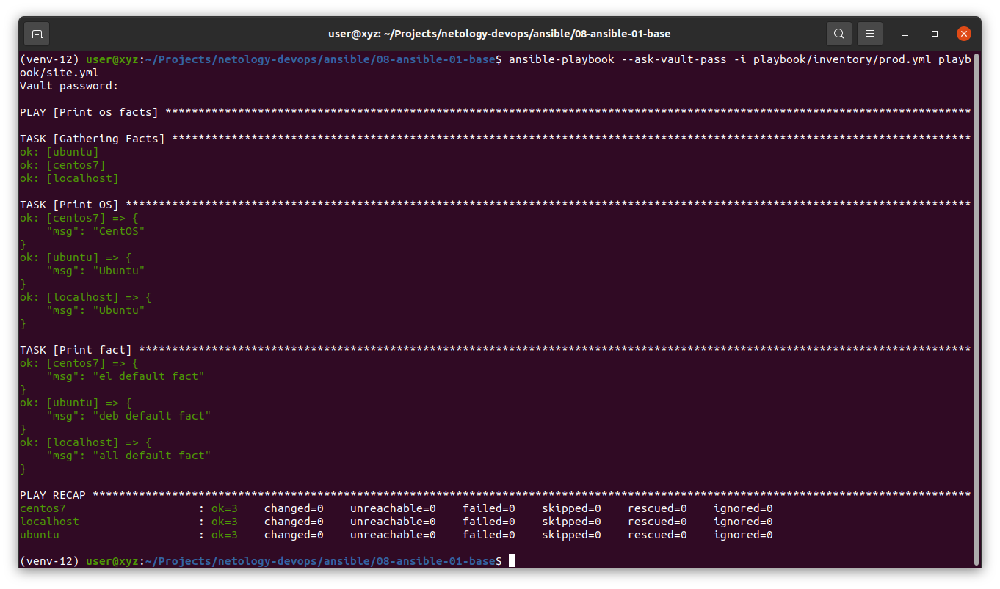
</details>


## Необязательная часть

### 1.

```bash
ansible-vault decrypt playbook/group_vars/{deb,el}/examp.yml
```

<details>
<summary>Скриншот</summary>

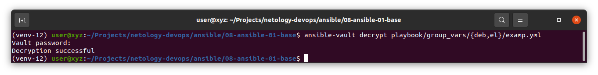
</details>

### 2+3.

Предположение:\
Предпологается, что была пропущена буква `a` в `group_vars/all/exmp.yml`, в названии файла `exAmp.yml`.

```bash
ansible-vault encrypt_string
ansible-playbook --ask-vault-pass -i playbook/inventory/prod.yml playbook/site.yml
```

<details>
<summary>Скриншот</summary>

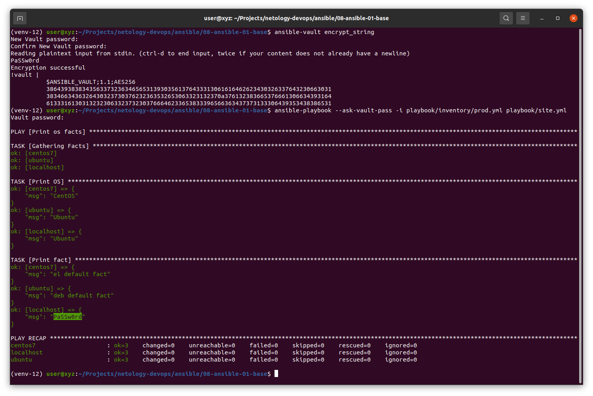
</details>

### 4.

Т.к. [pycontribs/fedora](https://hub.docker.com/r/pycontribs/fedora) не обновлялся последние 3 года решил не использовать его.

`fedora:40` c официального [репозитория](https://hub.docker.com/_/fedora) уже имеет предустановленный `Python`.

Предположение:\
`самостоятельно придумайте для неё переменную` -> предрологаю, что речь идёт только о значании переменной (`some_fact`), а не новом названии, т.к. [playbook](./playbook/site.yml) использует данную переменную.

<details>
<summary>Скриншот</summary>

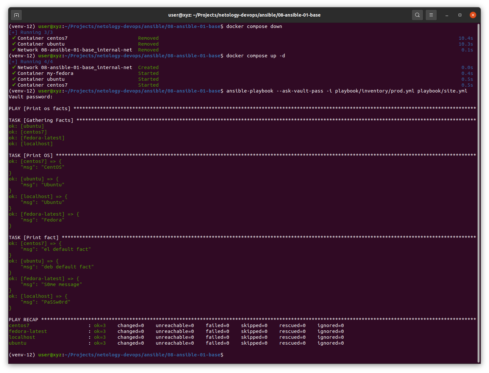
</details>

### 5.

[script.sh](./script.sh)

```bash
chmod +x script.sh
./script.sh
```

<details>
<summary>Скриншот</summary>

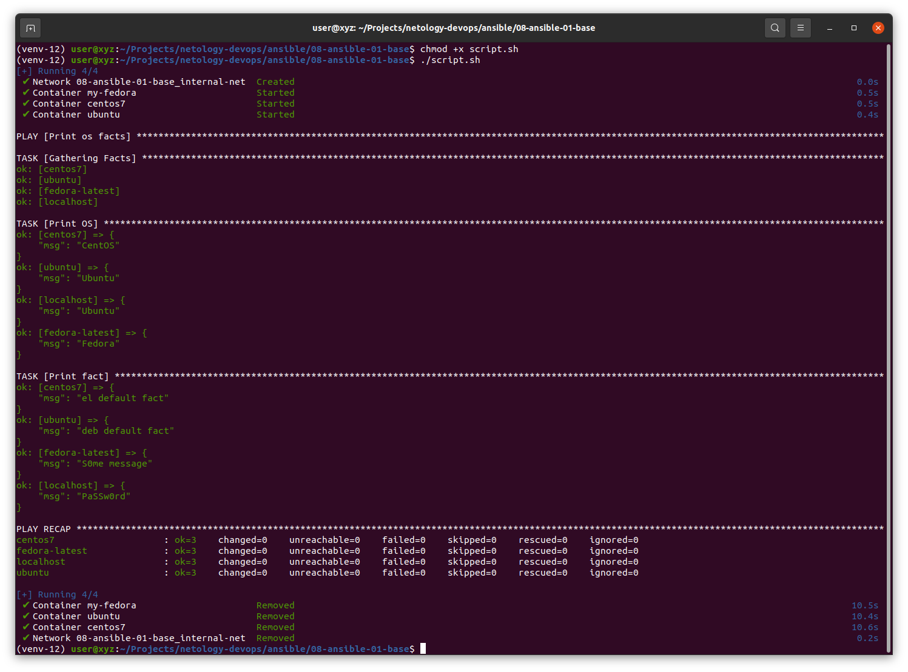
</details>

