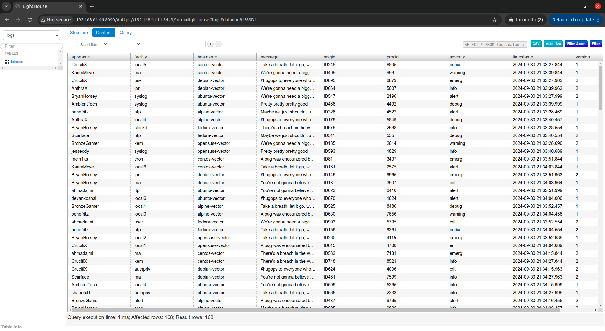
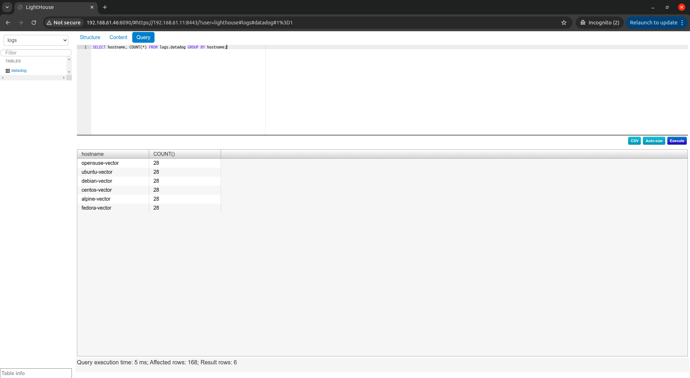
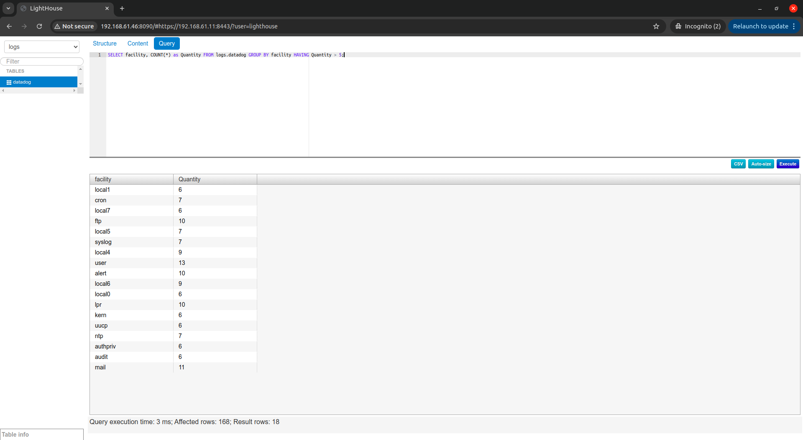

# Домашнее задание к занятию 4 «Работа с roles»


## Run:

<details>
<summary>Install prerequisities</summary>

* [Install LXD](https://canonical.com/lxd/install)
  - After: run `lxd init` and set defaults
* [Install Terraform](https://developer.hashicorp.com/terraform/tutorials/aws-get-started/install-cli)
  - You may need to add `.terraformrc` to your ${HOME} folder
</details>

<details>
<summary>Deploy infrastructure</summary>

```bash
# From 08-ansible-04-role directory

cd lxd
terraform init
terraform apply
cd ..
```
</details>

```bash
# From 08-ansible-04-role directory

ansible-galaxy install -r requirements.yml -p roles
ansible-playbook --vault-password-file password.txt -i playbook/inventory/lxd.yaml playbook/site.yml
```

## Roles

* [Vector-role](https://github.com/aguzovsk/netology-devops/tree/ansible-vector-role/ansible/08-ansible-04-role/roles/vector-role)
  - [Commit](https://github.com/aguzovsk/netology-devops/commit/ansible-vector-role-initial)
* [LightHouse-role](https://github.com/aguzovsk/netology-devops/tree/ansible-lighthouse-role/ansible/08-ansible-04-role/roles/lighthouse-role)
  - [Commit](https://github.com/aguzovsk/netology-devops/commit/ansible-lighthouse-role-initial)


## Demo
<details>
<summary>Lighthouse screenshots:</summary>

* Content Tab

* Query: `SELECT hostname, COUNT(*) FROM logs.datadog GROUP BY hostname;`

* Query: `SELECT facility, COUNT(*) as Quantity FROM logs.datadog GROUP BY facility HAVING Quantity > 5;`

</details>

## Misc

<details>
<summary>Commands used</summary>

```bash
# From 08-ansible-04-role directory

mkdir roles
cd roles
ansible-galaxy role init vector-role
ansible-galaxy role init lighthouse-role
```

```bash
# From 08-ansible-04-role directory

mkdir playbook/files
openssl dhparam -out playbook/files/dhparam.pem 4096
```

Install roles:
```bash
# From 08-ansible-04-role directory

source ../venv-12/bin/activate
ansible-galaxy install -r requirements.yml -p roles
```

Encrypt string:
```bash
ansible-vault encrypt_string
```

Terraform linting
```bash
# From 08-ansible-04-role directory

# Lint
docker run --rm --tty --volume $(pwd)/lxd:/tf bridgecrew/checkov --download-external-modules true --directory /tf
docker run --rm -v "$(pwd)/lxd:/tflint" --workdir /tflint ghcr.io/terraform-linters/tflint --recursive
# Documentation
docker run --rm --volume "$(pwd)/lxd:/terraform-docs" -u $(id -u) \
  quay.io/terraform-docs/terraform-docs markdown /terraform-docs \
  > lxd/README.md
```
</details>


<details>
<summary>Clickhouse role notes</summary>

Debian 13 — OK


Github репозиторий заархивирован.
* Новые версии операционных систем не поддерживаются
  - Ubuntu 24.04 (noble)
  - CentOS 9 Stream
* Список OS ограничен
* DEB822: В Debian-производных ОС не поддерживается новый подход добавления репозиториев — `deb822`
* Для `RHEL`-производных ОС нет возможности ("из коробки") обойти GPG-check для репозитория


Centos9 Stream:

Ansible playbook:
```
fatal: [clickhouse-01]: FAILED! => {"changed": false, "msg": "Failed to validate GPG signature for clickhouse-common-static-24.8.4.13-1.x86_64: Package clickhouse-common-static-24.8.4.13.x86_64.rpm is not signed"}
```

```bash
dnf install clickhouse-common-static
```
```
Downloading Packages:
[SKIPPED] clickhouse-common-static-24.8.4.13.x86_64.rpm: Already downloaded                                                                                                       
Package clickhouse-common-static-24.8.4.13.x86_64.rpm is not signed
The downloaded packages were saved in cache until the next successful transaction.
You can remove cached packages by executing 'dnf clean packages'.
Error: GPG check FAILED
```
</details>
