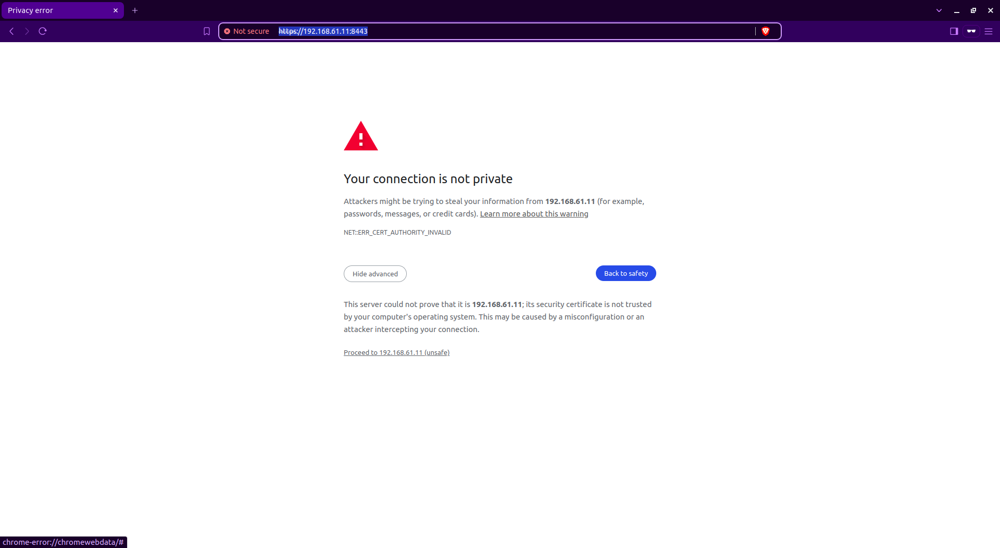
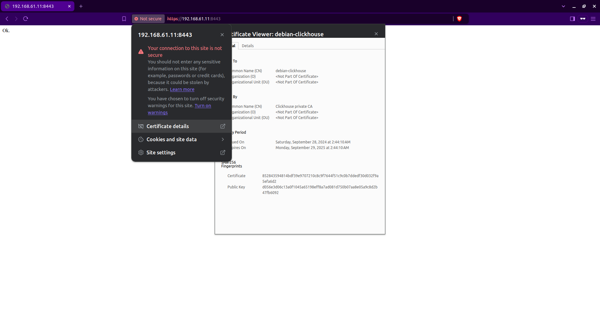

LightHouse Role
===============

Runs Nginx server that serves Lighthouse frontend for Clickhouse DB

Requirements
------------

Since this is just an application frontend for Clickhouse, an instance of Clickhouse DB should be up and running, IP and port for it should be provided

Role Variables
--------------

All are defined in `defaults`

| vars | default | description |
|------|---------|-------------|
| nginx_port | 8090 | Lighthouse Nginx service will listen on this port | 
| nginx_user | nginx | Service user on OS on which behalf Nginx service will be run |
| lighthouse_user | "{{ ansible_user }}" | OS user on which behalf most tasks are done |
| lighthouse_dir | /opt/lighthouse | Directory where Lighthouse Git repository will be fetched |

How to use
----------

Open in browser: \
http://{ip-of-lighthouse-instance}:{port-of-nginx}/#{http or https}://{clickhouse-ip-or-dns}:{clickhouse-port}/?user={clickhouse-user} \
Example: http://192.168.61.43:8090/#https://192.168.61.11:8443/?user=lighthouse

If TLS is used and private (selfsigned) CA (Certificate Authority) is used:
* use browser in private mode
* Connect to clickhouse through browser (i.e. https://192.168.61.11:8443) and accept self signed certificate authority
* Now, Lighthouse can be used (i.e http://192.168.61.43:8090/#https://192.168.61.11:8443/?user=lighthouse)

Browser images

Dependencies
------------

None

Example Playbook
----------------

Including an example of how to use your role (for instance, with variables passed in as parameters) is always nice for users too:

    - hosts: lighthouse
      roles:
         - { role: lighthouse-role }

License
-------

BSD
