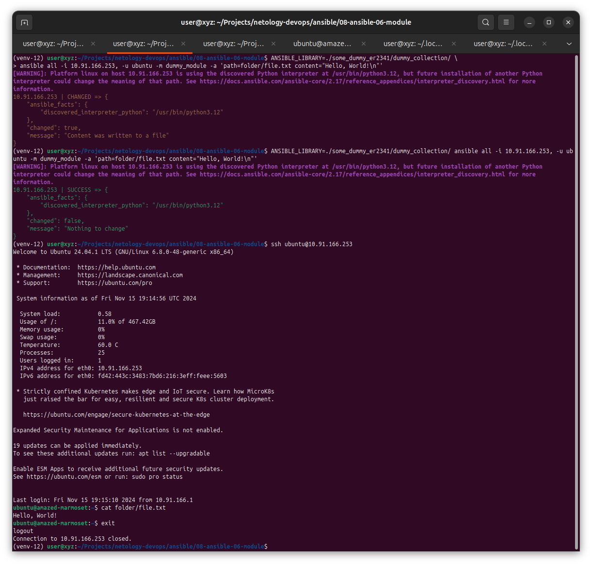
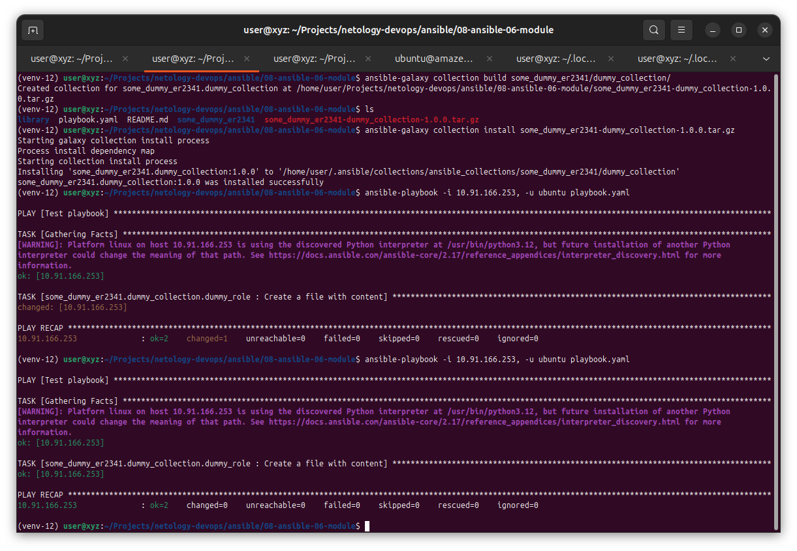

# Домашнее задание к занятию 6 «Создание собственных модулей»

[Docs: creating module](https://docs.ansible.com/ansible/latest/dev_guide/developing_modules_general.html)

[Collection](https://github.com/aguzovsk/netology-devops/tree/ansible-dummy-collection/ansible/08-ansible-06-module/some_dummy_er2341/dummy_collection)

[Archive](./some_dummy_er2341-dummy_collection-1.0.0.tar.gz)

<details>
<summary>Screenshots</summary>



</details>

<details>
<summary>Commands</summary>

```bash
ansible-galaxy collection init some_dummy_er2341.dummy_collection
mkdir some_dummy_er2341/dummy_collection/plugins/modules/
# Create and polupate file dummy_module.py

cd some_dummy_er2341/dummy_collection/roles
ansible-galaxy role init dummy_role
# Create and populate dummy_role

cd ../../..

# Test dummy_module
ANSIBLE_LIBRARY=./some_dummy_er2341/dummy_collection/ \
ansible all -i 10.91.166.253, -u ubuntu -m dummy_module \
-a 'path=folder/file.txt content="Hello, World!\n"'

ansible-galaxy collection build some_dummy_er2341/dummy_collection/
ansible-galaxy collection install some_dummy_er2341-dummy_collection-1.0.0.tar.gz

ansible-playbook -i 10.91.166.253, -u ubuntu playbook.yaml
ansible-playbook -i 10.91.166.253, -u ubuntu playbook.yaml

rm -rf ~/.ansible/collections/ansible_collections/some_dummy_er2341/
```
</details>