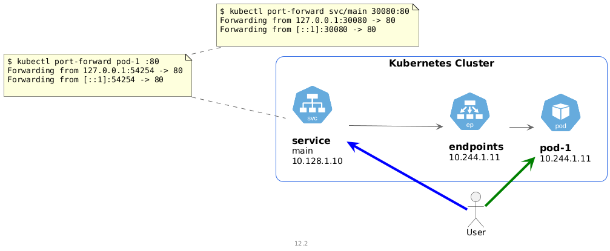
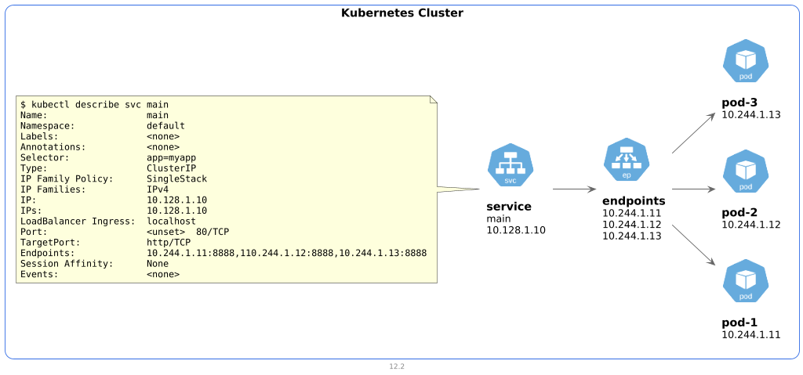
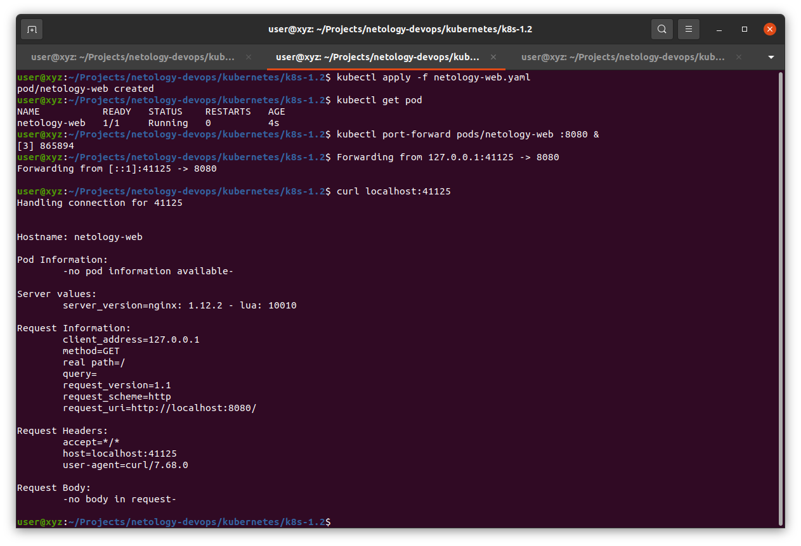
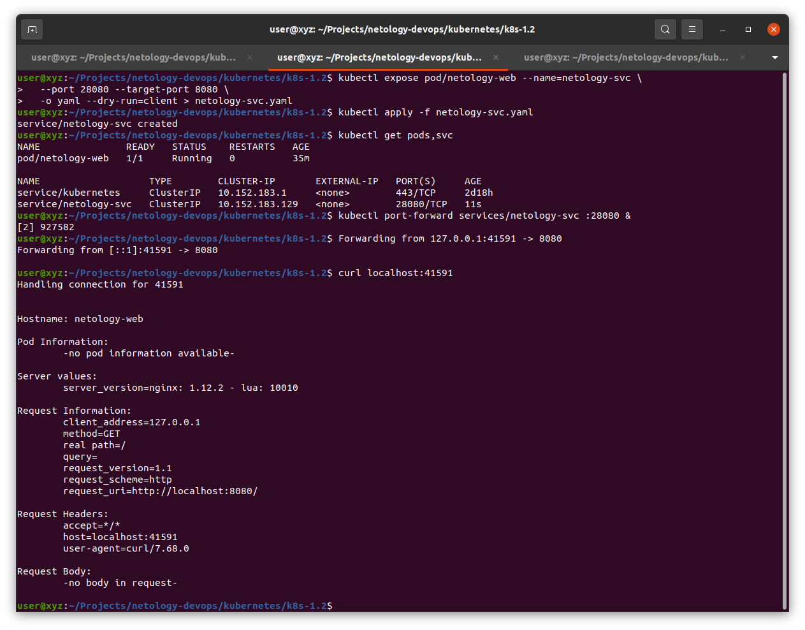

# Домашнее задание к занятию «Базовые объекты K8S»

## Диаграммы к заданию

<details>
<summary>Диаграммы</summary>

* Port forward \


* Service \


</details>

## Преконфигурация

Модификация `KUBECONFIG` чтобы путь был абсолютным.\
Перейти в папку с конфигурацией

```bash
# Use absolute path for KUBECONFIG
export KUBECONFIG=$PWD/microk8s-config.yaml
```

[Bash completion](https://kubernetes.io/docs/tasks/tools/install-kubectl-linux/#enable-kubectl-autocompletion)
```bash
echo 'source <(kubectl completion bash)' >>~/.bashrc
source ~/.bashrc
```

## Выполнение

### 1

<details>
<summary>Команды</summary>

```bash
kubectl run netology-web \
  --image=gcr.io/kubernetes-e2e-test-images/echoserver:2.2 \
  -o yaml --dry-run=client > netology-web.yaml

kubectl apply -f netology-web.yaml

kubectl port-forward pods/netology-web :8080 &

curl localhost:$PORT
```
</details>

<details>
<summary>Скриншот</summary>


</details>


### 2

<details>
<summary>Команды</summary>

Шаг 1-2 выполнены в [п.1 ](#1)

```bash
kubectl expose pod/netology-web --name=netology-svc \
  --port 28080 --target-port 8080 \
  -o yaml --dry-run=client > netology-svc.yaml

# kubectl create service clusterip netology-svc \
#   --tcp=28080:8080 \
#   -o yaml --dry-run=client > netology-svc.yaml

kubectl apply -f netology-svc.yaml

kubectl port-forward services/netology-svc :28080 &

curl localhost:$PORT
```

</details>

<details>
<summary>Скриншот</summary>


</details>

### Clear

Убить процесс `port-forward`
```bash
jobs

kill %1 # may be any other number, is seen within [] in jobs listing
```

```bash
kubectl delete -f .
```

