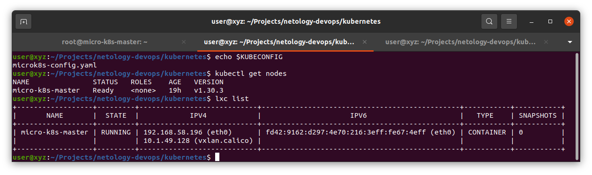
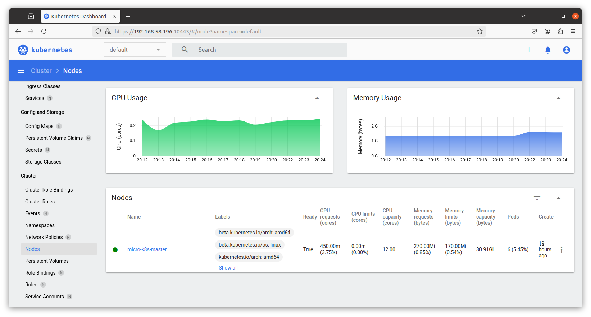

# Домашнее задание к занятию «Kubernetes. Причины появления. Команда kubectl»

## Ответ

<details>
<summary>Скриншоты</summary>



</details>


## Команды

### Установка microK8s на LXC контенер

[Docs](https://microk8s.io/docs/install-lxd)

```bash
lxc profile create microk8s
curl https://raw.githubusercontent.com/ubuntu/microk8s/master/tests/lxc/microk8s.profile | lxc profile edit microk8s
```

```bash
lxc launch -p default -p microk8s ubuntu micro-k8s-master
lxc shell micro-k8s-master

cat > /etc/rc.local <<EOF
#!/bin/bash

apparmor_parser --replace /var/lib/snapd/apparmor/profiles/snap.microk8s.*
exit 0
EOF

chmod +x /etc/rc.local

sudo snap install microk8s --classic
```
                                                                                            

### Установка и настройка kubectl

<details>
<summary> Установка kubectl</summary>

 [Docs](https://kubernetes.io/docs/tasks/tools/install-kubectl-linux/)

 ```bash
# Ubuntu
sudo apt-get update
curl -fsSL https://pkgs.k8s.io/core:/stable:/v1.31/deb/Release.key | sudo gpg --dearmor -o /etc/apt/keyrings/kubernetes-apt-keyring.gpg
sudo chmod 644 /etc/apt/keyrings/kubernetes-apt-keyring.gpg
echo 'deb [signed-by=/etc/apt/keyrings/kubernetes-apt-keyring.gpg] https://pkgs.k8s.io/core:/stable:/v1.31/deb/ /' | sudo tee /etc/apt/sources.list.d/kubernetes.list
sudo chmod 644 /etc/apt/sources.list.d/kubernetes.list
sudo apt-get update
sudo apt-get install -y kubectl
```
</details>

```bash
microk8s config > microk8s-config.yaml
lxc file pull micro-k8s-master/root/microk8s-config.yaml .
export KUBECONFIG=microk8s-config.yaml
```

### Запуск dashboard

```bash
# microk8s enable dashboard
microk8s dashboard-proxy
```

```bash
# Was set up automatically by microk8s 
# microk8s kubectl port-forward -n kube-system service/kubernetes-dashboard 10443:443 --address 0.0.0.0
```

> [!CAUTION]
> Не следует использовать Chrome-based браузеры, т.к. есть проблемы при подключении с самоподписными сертификатами