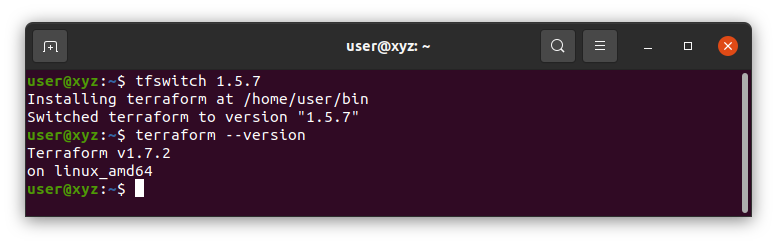
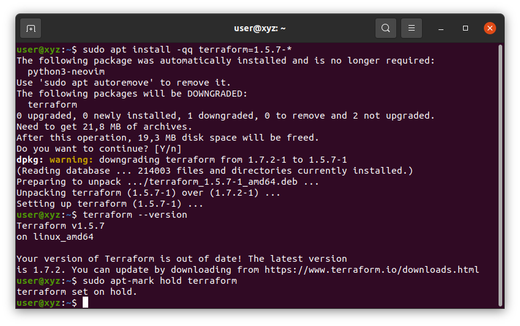
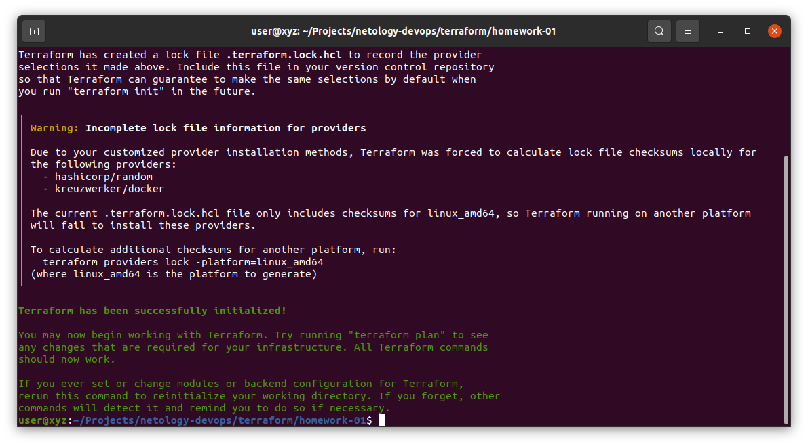
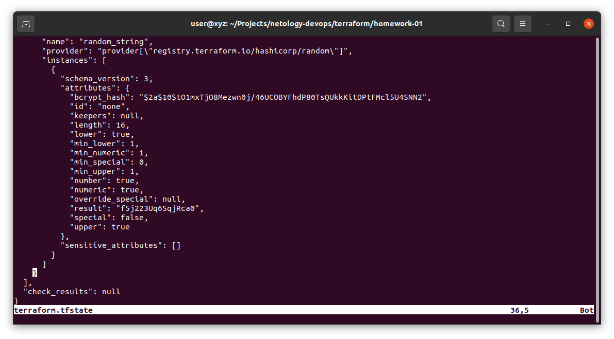
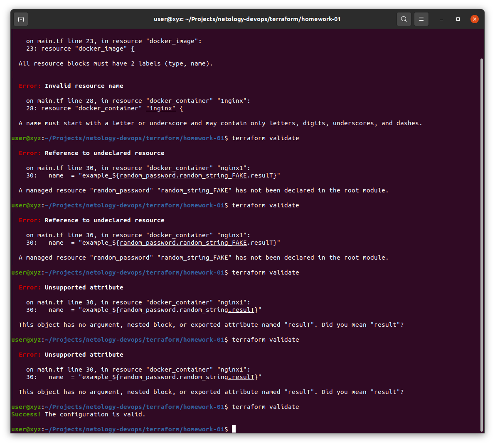
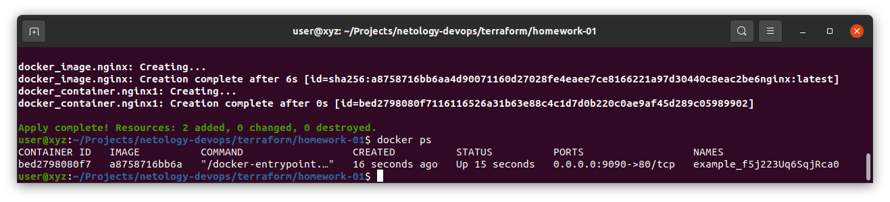
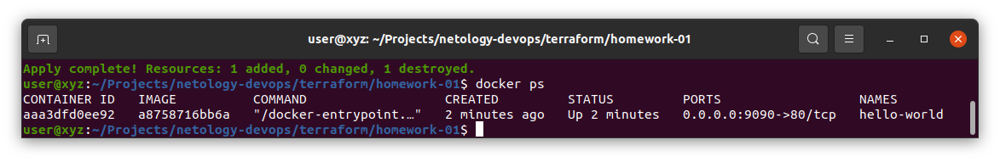
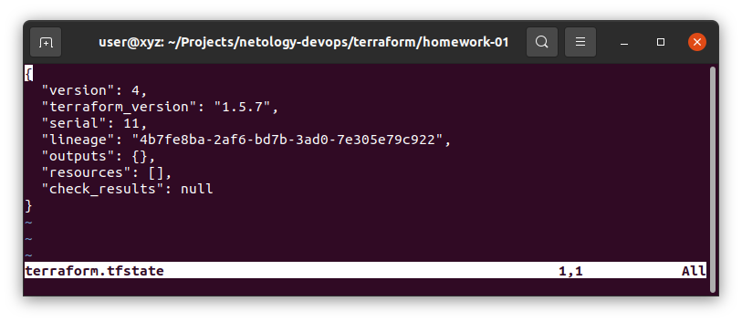
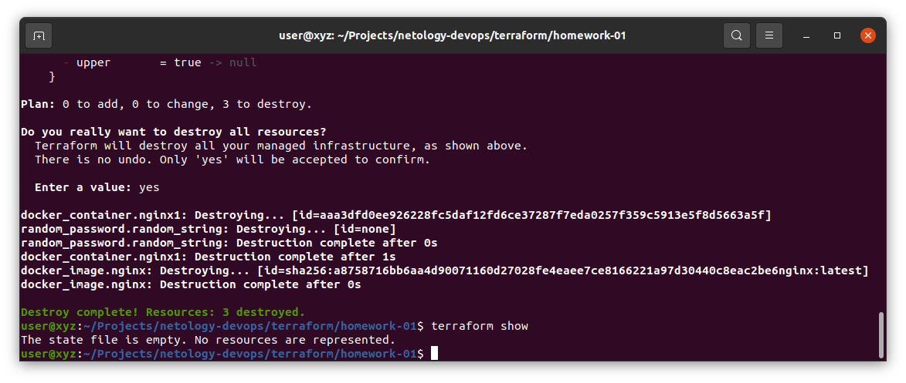

# Домашнее задание к занятию «Введение в Terraform»
## Чек-лист
Не удалось использовать tfswitch



Установка terraform 1.5.7


## Задание 1
### 1.


### 2.
Секретную информацию нужно хранить в файлах, которые не будет учитывать и сохранять git, а именно те файлы и папки, которые находятся в .gitignore
Но, комментарий указывает, что лучше использоватьспециально отведёный для это файл — personal.auto.tfvars

### 3.
"result": "f5j223Uq6SqjRca0"


### 4.
1. 23: All resource blocks must have 2 labels (type, name).
В данном случае не было указано имя ресурса
2. 28: A name must start with a letter or underscore and may contain only letters, digits, underscores, and dashes.
3. 30: A managed resource "random_password" "random_string_FAKE" has not been declared in the root module.
  This object has no argument, nested block, or exported attribute named "resulT". Did you mean "result"?
  1. random_string_FAKE => нет такого имени, только random_string
  2. resulT => должно быть result



### 5.
```
resource "docker_image" "nginx" {
  name         = "nginx:latest"
  keep_locally = true
}

resource "docker_container" "nginx1" {
  image = docker_image.nginx.image_id
  name  = "example_${random_password.random_string.result}"

  ports {
    internal = 80
    external = 9090
  }
}
```
Созданный контейнер


### 6.
-auto-approve -- apply не спрашивает подтверждения для изменения инфраструктуры.


### 7.





### 8.
[Doc](https://docs.comcloud.xyz/providers/kreuzwerker/docker/latest/docs/resources/image#optional)
Есть 2 опциональных значения, которые могут отвечать за сохранение/удаление образа, при операции destroy. Значения по-умолчанию в документации не написаны, но по результату мы можем догадаться.
  * force_remove (optional) [False] 
  * keep_locally (optional) {True]


## Задание 2.

**Пункты 1-2** код в репозитории.

