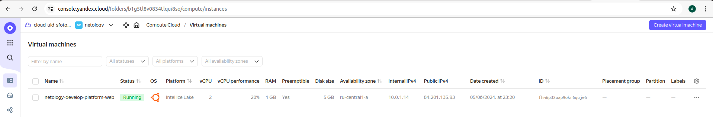
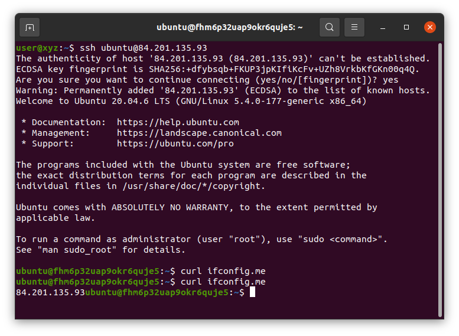
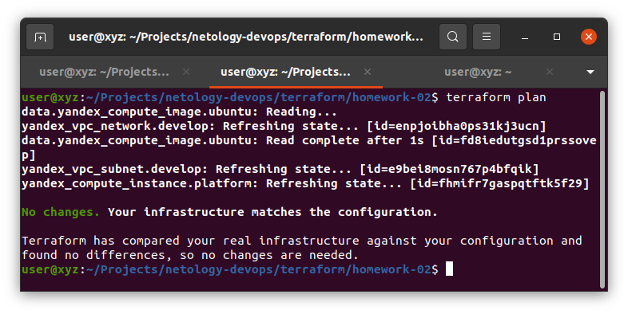
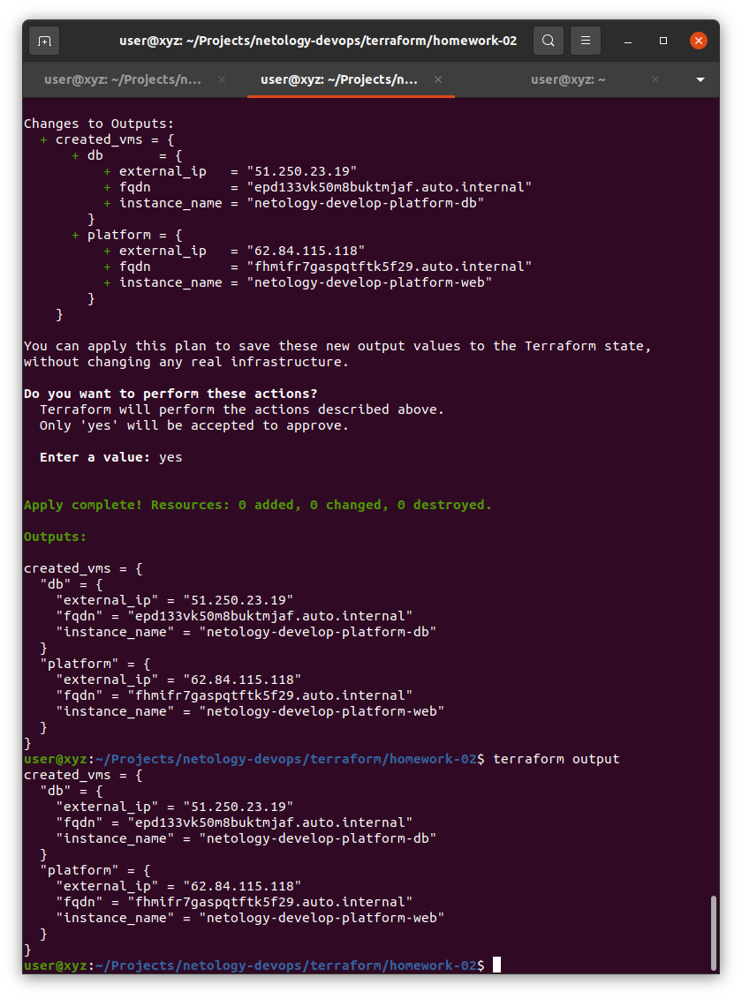

# Домашнее задание к занятию «Основы Terraform. Yandex Cloud»
## Задание 1.
### 4. Ошибки:
main.tf line 15, in resource "yandex_compute_instance" "platform": \
17: platform_id = "standart-v4"
Такого id платформы для вирутальных машин нет, есть v1, v2, v3. \
Если мы откатимя до "standard-v3", то нам нужно будет изменить так же значения
* allowed core fractions: 20, 50, 100  --> 20
* allowed core number: 2, 4 --> 20

### 5.

### 6.
* Позволяет снизить стоимость виртуальной машины, в замен за то, что виртуальная машина может быть выключена, а ресурсы пережаны в пользование другим пользователям ([Документация](https://yandex.cloud/en/docs/compute/concepts/preemptible-vm))
* Использование долей процессора (fraction) также позволяет снизить стоимость. [Калькулятор](https://yandex.cloud/en/prices)

## Задание 2.

## Задание 4.

## Задание 3, 5, 6
См. код

