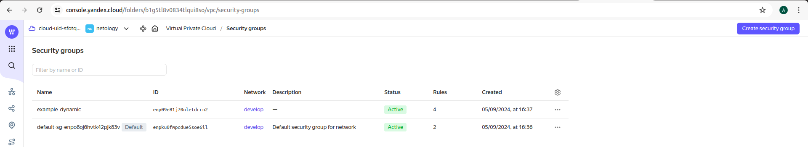
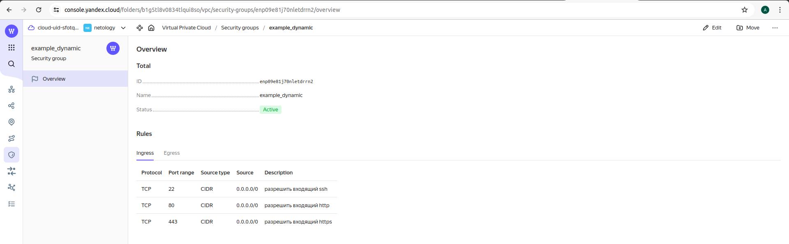
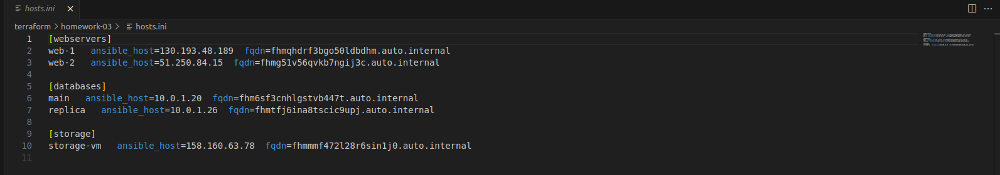
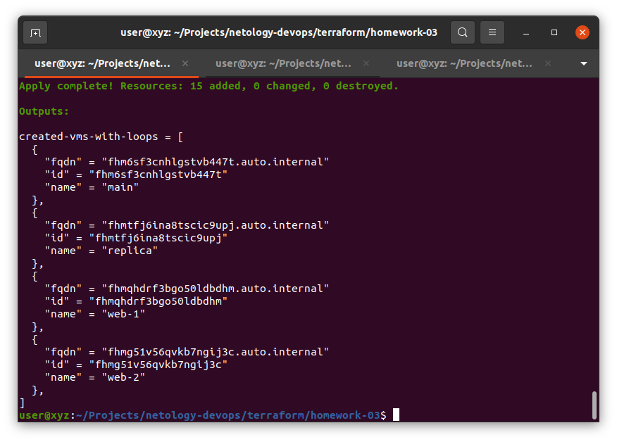
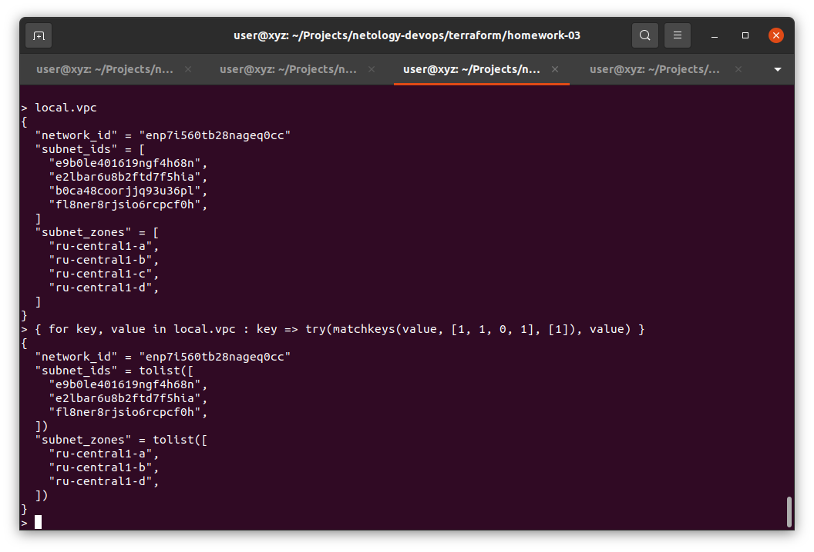

# Домашнее задание к занятию «Управляющие конструкции в коде Terraform»
## Задание 1.

## Задание 4.

## Задание 5.

## Задание 7.
{ for key, value in local.vpc : key => try(matchkeys(value, [1, 1, 0, 1], [1]), value) }

## Задания 2, 3, 6
В коде
