# Домашнее задание к занятию «Использование Terraform в команде»

## Задание 1.
```bash
# run from netology-devops/terraform/homework-05 directory

```
сheckov:
* Check: CKV_TF_1: "Ensure Terraform module sources use a commit hash"
* Check: CKV_TF_2: "Ensure Terraform module sources use a tag with a version number"

С флагом **--download-external-modules true**:
* Check: CKV_YC_2: "Ensure compute instance does not have public IP."
* Check: CKV_YC_4: "Ensure compute instance does not have serial console enabled."
* Check: CKV_YC_11: "Ensure security group is assigned to network interface."

_(Найдены только в папке demonstration1)_

```bash
# run from netology-devops/terraform/homework-05 directory
docker run --rm -t -v "$(pwd)/task1:/tflint" --workdir /tflint  ghcr.io/terraform-linters/tflint "--recursive"
```

<details>
<summary>Альтернативно</summary>

```bash
# run from netology-devops/terraform/homework-05 directory
docker run --rm -t -v "$(pwd)/task1:/tflint" --entrypoint=/bin/sh  ghcr.io/terraform-linters/tflint -c "cd /tflint; tflint --recursive"
# OR
docker run --rm -t -v "$(pwd)/task1:/tflint" ghcr.io/terraform-linters/tflint "--chdir" "/tflint/src"; \
docker run --rm -t -v "$(pwd)/task1:/tflint" ghcr.io/terraform-linters/tflint "--chdir" "/tflint/demonstration1"
```
</details>

tflint:
* Warning: Module source "git::https://github.com/udjin10/yandex_compute_instance.git?ref=main" uses a default branch as ref (main) (terraform_module_pinned_source)
* Warning: Missing version constraint for provider "template" in `required_providers` (terraform_required_providers)
* Warning: [Fixable] variable "public_key" / "vms_ssh_root_key" / "vm_web_name" / "vm_db_name" is declared but not used (terraform_unused_declarations)

## Задание 2.

#### Пункт 2.
<details>
<summary>Ответ</summary>

S3 Bucket и YDB создаются в коде (см. [Задание №7](#задание-7))

* Миграция **terraform.tfstate** в S3 bucket \
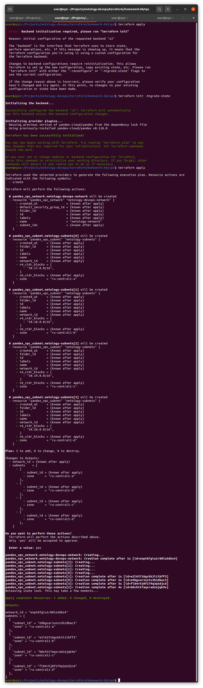
* S3 bucket после миграции \
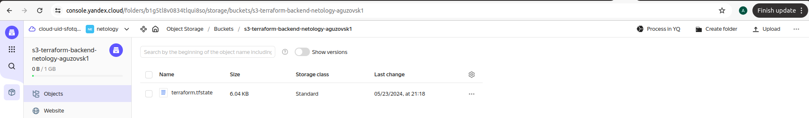
</details>

#### Пункты 4-6.
<details>
<summary>Ответ</summary>

* Запущен **terraform destroy**, который ожидает исполнения \
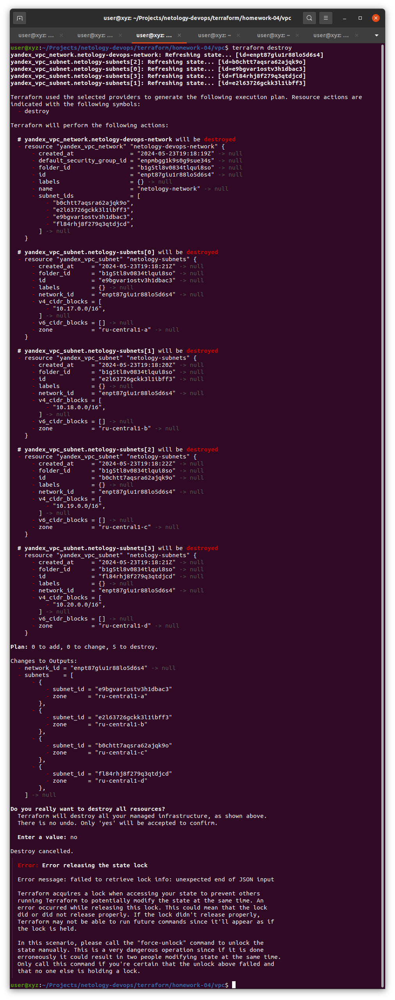
* Попытка захватить lock, а также разные способы его разблокировки \
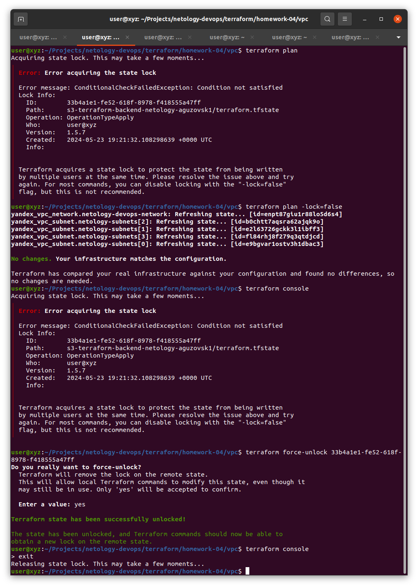
</details>

## Задание 3.
Должно быть в pull-request ...

```bash
# run from netology-devops/terraform directory
docker run --rm --tty --volume $(pwd)/homework-04:/tf bridgecrew/checkov \
   --download-external-modules true --directory /tf
docker run --rm --tty --volume $(pwd)/homework-05/s3-tfstate:/tf bridgecrew/checkov \
   --download-external-modules true --directory /tf

docker run --rm -v "$(pwd)/homework-04:/tflint" --workdir /tflint ghcr.io/terraform-linters/tflint "--recursive"
docker run --rm -v "$(pwd)/homework-05/s3-tfstate:/tflint" --workdir /tflint ghcr.io/terraform-linters/tflint
```

<details>
<summary>Альтернативно</summary>

```bash
# run from netology-devops/terraform directory
checkov -d homework-04
checkov -d homework-05/s3-tfstate/

docker run --rm -t -v "$(pwd)/homework-04:/tflint" --entrypoint=/bin/sh  ghcr.io/terraform-linters/tflint -c "cd /tflint; tflint --recursive"
docker run --rm -t -v "$(pwd)/homework-05/s3-tfstate:/tflint" ghcr.io/terraform-linters/tflint "--chdir" "/tflint"
```
</details>

## Задание 4+5.
<details>
<summary>Скриншоты</summary>

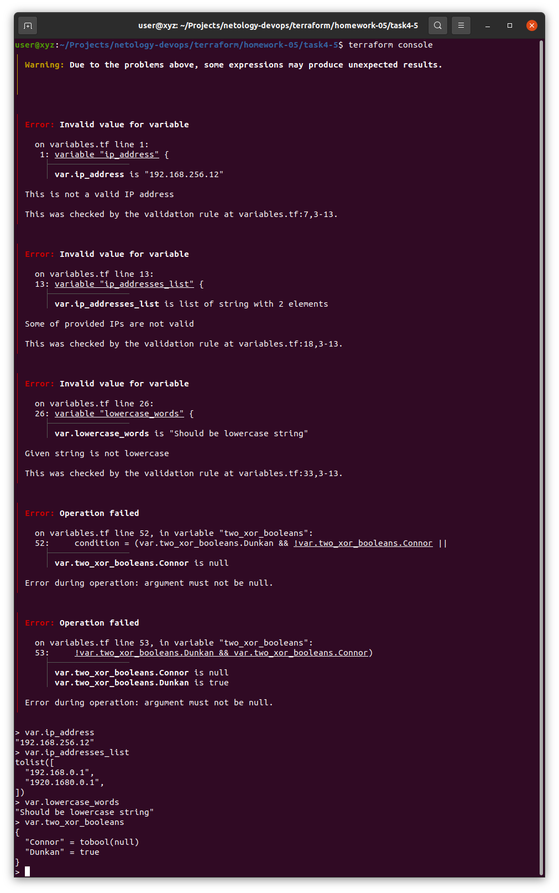
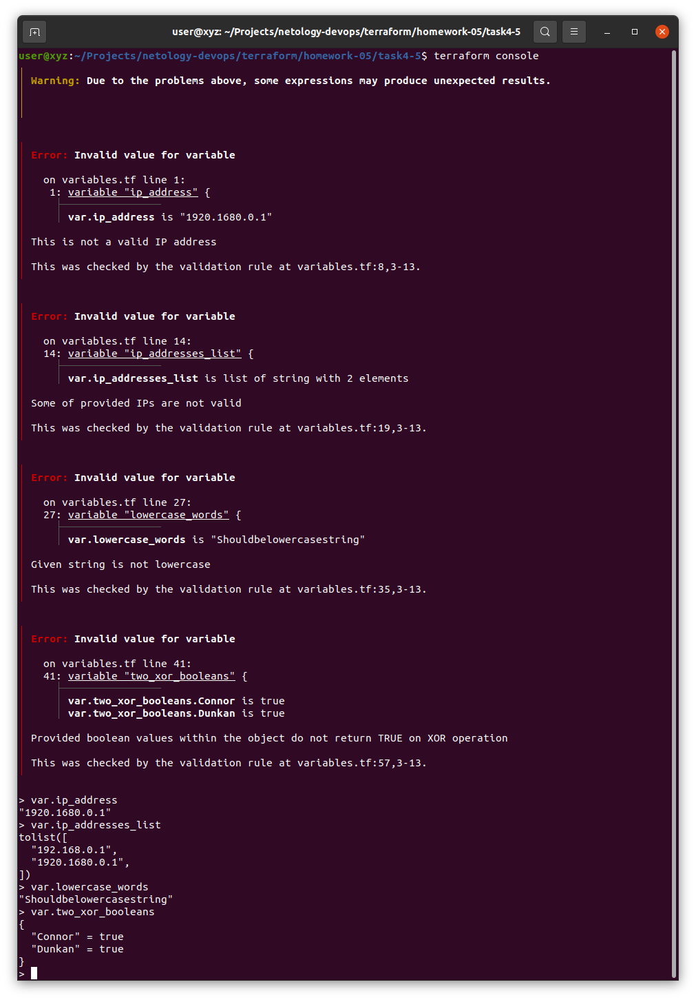
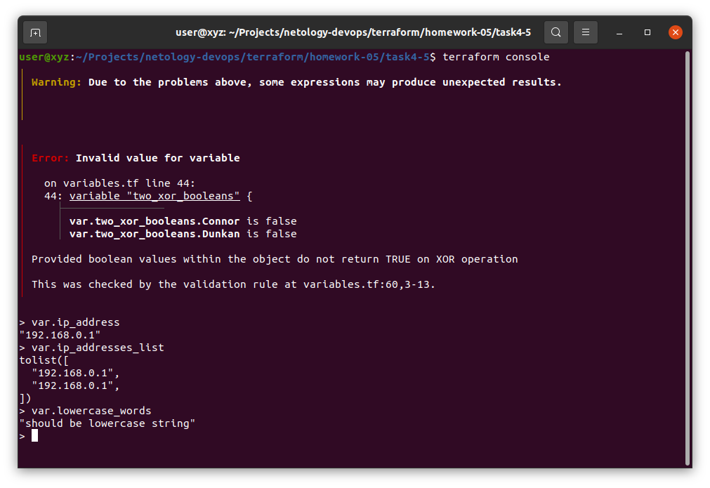
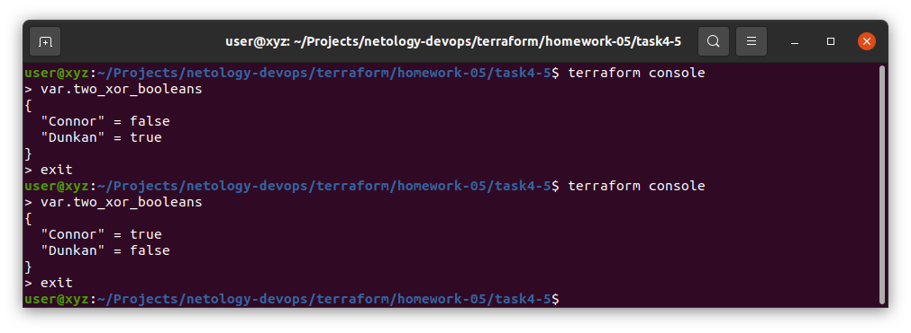
</details>

## Задание 7.
### Создание и конфигурация S3
Поскольку создание S3 bucket происходит в коде, а также здесь даются права, то создающий S3 bucket должен обладать, как минимум **storage.admin** правами доступа. 
Поэтому нужно хотя бы минимальное разделение ролей. \
Создаются 2 service account:
* storage.admin (можно не создавать, если он был передан в модуль как аргумент *bucket_admin*)
* storage.uploader

Не использую [terraform-yc-s3](https://github.com/terraform-yc-modules/terraform-yc-s3) модуль, т.к. не вижу особой необходимости, а он добавляет дополнительную зависимость — AWS CLI, хотя от этой зависимости не удалось отказаться в итоге. \

### Создание и конфигурация YDB
Т.к. в YDB не поддерживается такое же разделение ролей как и в YC S3, то здесь я этого не делал. \
\
Невозможно создать **Document table** из terraform. Yandex Provider [v0.119.0](https://terraform-provider.yandexcloud.net/Resources/ydb_table) поддерживает создание только YDB Row Tables. \
В документации есть только primary_key, но нет partition_key, разве что подразумевается, что это одно и тоже.
(актуально для yandex [v0.199.0](https://registry.terraform.io/providers/yandex-cloud/yandex/0.119.0/docs/resources/ydb_table)) \
\
Делал попытки ([см.код.](./s3-tfstate/ydb.tf#L41)) "мимикрировать" под Document table, подставляя нужные аттрибуты (которые скопировал при **terraform import**), но не получилось. 
Выдаёт ошибку: "Document API table cannot be modified from YQL query" и прочие. \
\
В YC CLI [v0.125.0] нет возможности создания таблицы (table) в YDB (можно создать только database). \
Зато можно создать через AWS CLI, как это описано в [документации](https://yandex.cloud/en/docs/ydb/docapi/tools/aws-cli/create-table). 
Что и было сделано через скрипт в [terraform_data](./s3-tfstate/main.tf#L67). \
\
Пример с YDB Document table [код](https://github.com/yandex-cloud-examples/yc-serverless-ydb-api/blob/main/main.tf#L28) 
([permalink](https://github.com/yandex-cloud-examples/yc-serverless-ydb-api/blob/c5bf360de6a07b8ba4b98e359a36f169d68ece09/main.tf#L28)) —
используется такой же подход как и у меня (через скрипт + AWS CLI).

<details>
<summary>Ошибки при "мимикрировании"</summary>

+ **terraform import** Document-based YDB table \
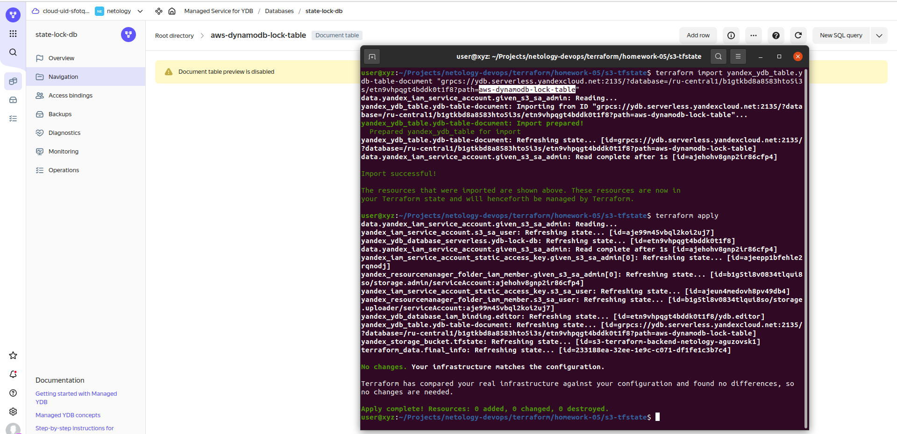
+ **terraform replace** Попытка сделать replace Document-based YDB таблицы. \
YC provider не может даже удалить Document YDB table. \
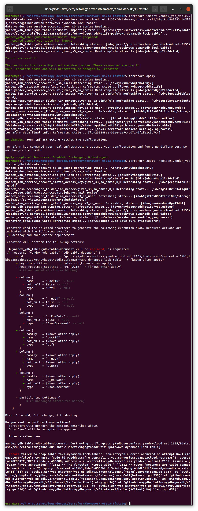
+ Попытка создания Document-based YDB таблицы (копируя аттрибуты Document-based YDB таблицы) ([код (закоментированный)](./s3-tfstate/ydb.tf#L41)) \
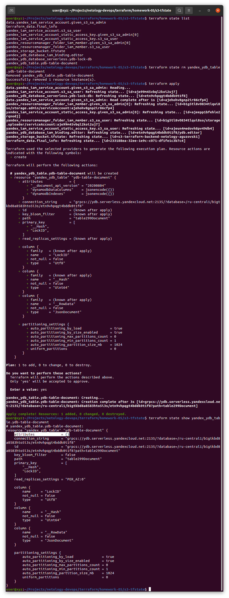
+ YDB YC Web-Console \
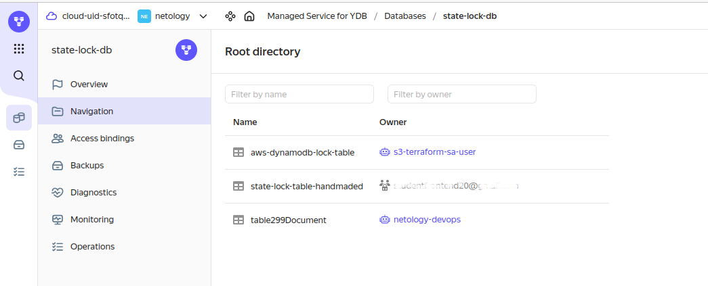
+ Созданная таблица оказалась Row-based \
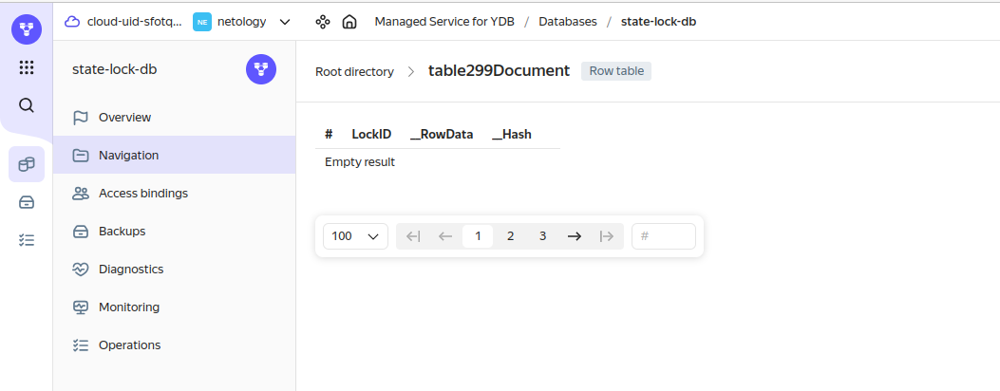
+ Row-based YDB таблицу нельзя использовать для terraform state lock
</details>


### Работа с Yandex S3 с включенным версионированием
Может возникнуть потребность вручную через Yandex Web-console удалить bucket. Но, если файл туда уже загружен, то удаяляя фал (объект) его через Yandex Web-Console (и Вы не приостановили версионирование преждевременно) Вы только добавляете маркер удаления.

* Вывести версии объектов в S3 bucket:
```bash
aws --endpoint-url=https://storage.yandexcloud.net/ \
   --profile {aws-profile-name} \
   s3api list-object-versions \
   --bucket {your-bucket-name}
```

<details>
<summary>Результат команды (список версий объектов)</summary>

```json
{
    "Versions": [
        {
            "ETag": "\"b24561462b7398a0f28cf2b475ed407c\"",
            "Size": 6189,
            "StorageClass": "STANDARD",
            "Key": "terraform.tfstate",
            "VersionId": "0006190E456DBCFA",
            "IsLatest": false,
            "LastModified": "2024-05-22T17:29:05.320000+00:00",
            "Owner": {
                "DisplayName": "${yandex-id-of-length-20}",
                "ID": "${yandex-id-of-length-20}"
            }
        }
    ],
    "DeleteMarkers": [
        {
            "Owner": {
                "DisplayName": "${yandex-id-of-length-20}",
                "ID": "${yandex-id-of-length-20}"
            },
            "Key": "terraform.tfstate",
            "VersionId": "00061919F63DDF8A",
            "IsLatest": true,
            "LastModified": "2024-05-23T07:25:56.390000+00:00"
        }
    ],
    "RequestCharged": null
}
```
</details>

* Удалить версию объекта (в том числе маркер удаления):

```bash
aws --endpoint-url=https://storage.yandexcloud.net/ \
   --profile {aws-profile-name} \
   s3api delete-object \
   --bucket {your-bucket-name} \
   --key {terraform.tfstate} \
   --version-id {0006190E456DBCFA}
```

* Удалив верcии объекта можно удалить bucket из Yandex Web-Console. Или так:
```bash
aws --endpoint-url=https://storage.yandexcloud.net/ \
   --profile {aws-profile-name} \
   s3api delete-bucket \
   --bucket {your-bucket-name}
```
