# Домашнее задание к занятию 4 (_Решение_) «Оркестрация группой Docker контейнеров на примере Docker Compose»
## Задание 1
Ссылка на Docker Hub: \
https://hub.docker.com/repository/docker/netologydevops/custom-nginx/general \
или https://hub.docker.com/r/netologydevops/custom-nginx/tags
## Задание 2
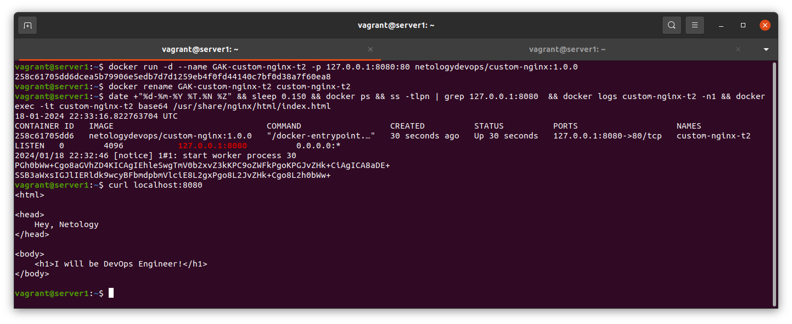
## Задание 3
**Пункты 1-9**
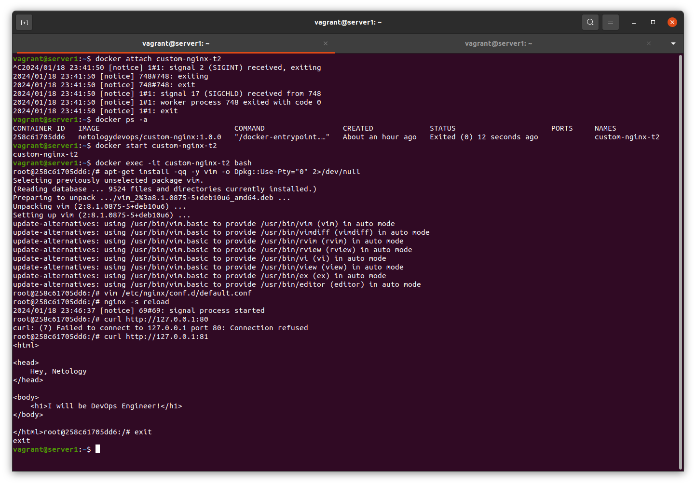
__3.__ Контейнер остановился, т.к. таким способом мы ему выслали сигнал SIGINT - прерывание/завершение программы.

**Пункты 10-12**
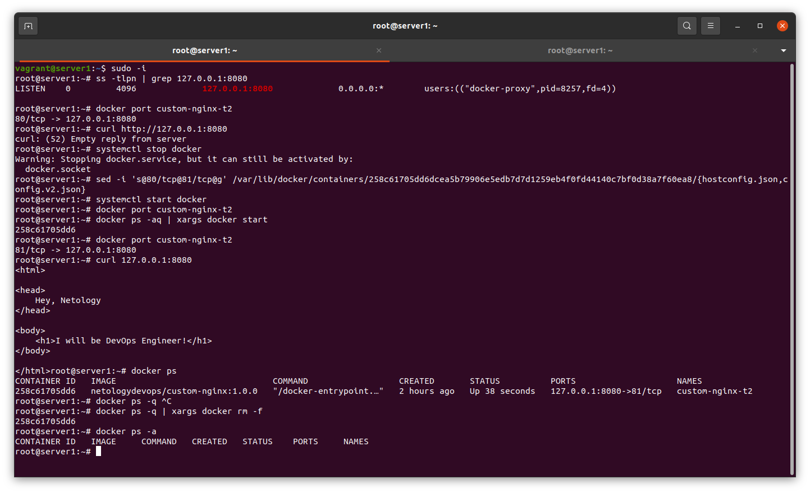
__10.__ Т.к. порт Nginx-сервера был изменён на 81, то больше нет возможности коммуницировать с ним через порт 80.
## Задание 4
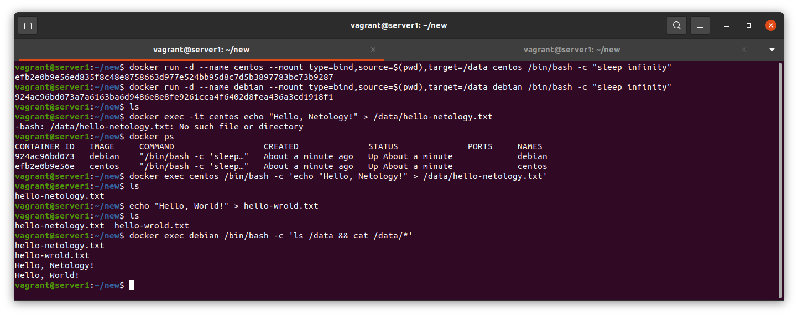
## Задание 5
**Пункт 1**
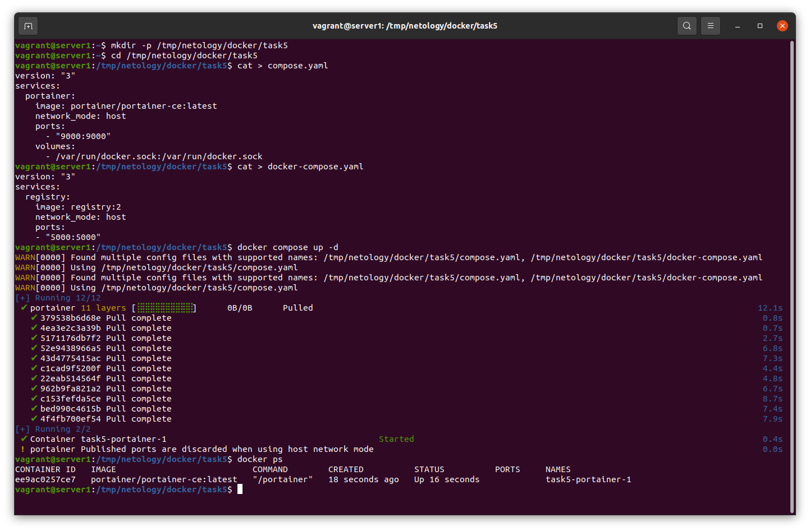
Был запущен portainer, т.к. он находился в файле compose.yaml,
В [документации](https://docs.docker.com/compose/reference/#specifying-multiple-compose-files) написано, что можно подать множество compose-файлов на вход, с помощью флага -f. Но, это опционально, по умолчанию docker compose ищет файл compose.yml и compose.override.yml.

**Пункт 2**

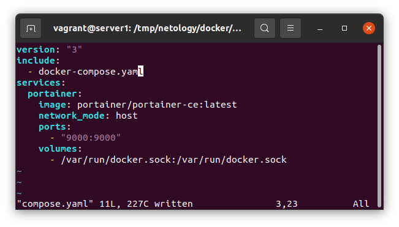 

**Пункты 2, 3**
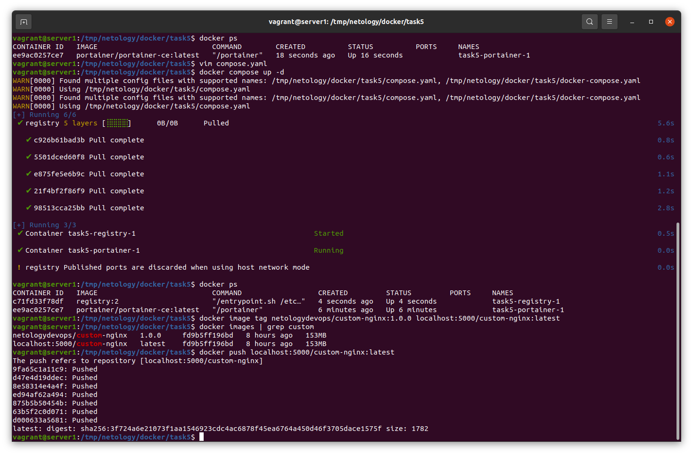 

**Пункты 4, 5, 6**
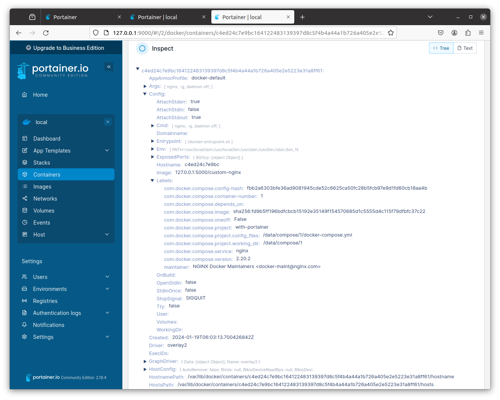 
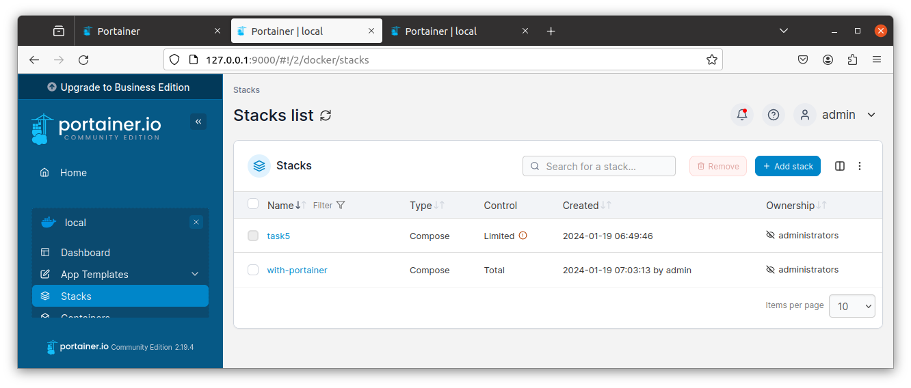 

  
Troubleshouting

  + Не было возможности запустить браузер на виртуальной машине, т.к. она была запущена в консольном режиме. \
  Для этого нужно было сделать port forwarding от ВМ до хоста.
  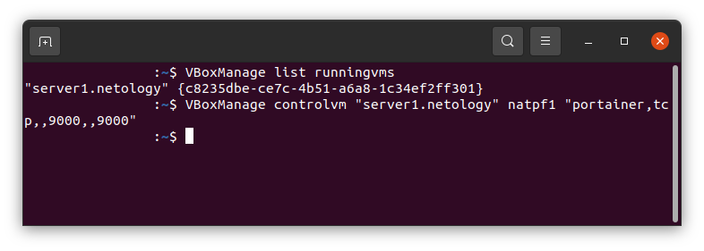
  + Нужно было перезапустить контейнер с portainer, т.к. он после некоторого времени ожидания перестаёт отвечать.
  + После перезапуска браузер Chrome на хост машине не принимал от portainer соединения и выдавал ERR_SSL_PROTOCOL_ERROR \
  FireFox тоже не выдавал ошибку связанную с SSL, но вскоре по непонятным причинам заработал.

**Пункт 7**
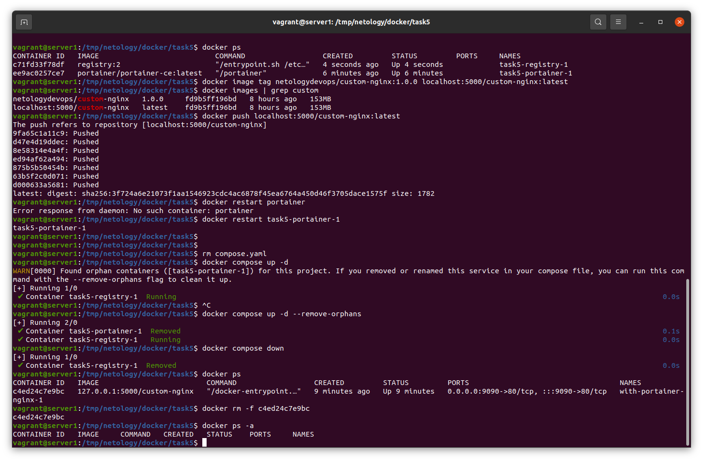 \
Был найден осиротелый контейнер - не было обнаружено его дефиниции в compose-файле, где он был прежде. Docker compose предлагает удалить такие контейнера, если мы подадим дополнительно опцию --remove-orphans.
