# Домашнее задание к занятию 5. «Практическое применение Docker»


## Задание 1.

Сделал "Fork" через `git submodule` чтобы не нагромождать репозитории в GitHub аккаунте
```bash
# from virtd/04-docker-in-practice

git submodule add git@github.com:netology-code/shvirtd-example-python.git
# cd shvirtd-example-python
# git checkout ecccb386d0ecaf0eaca8e993ed35473f7ad73f28
```

```bash
docker build . \
    -t web-app-image \
    --build-arg src_folder=shvirtd-example-python \
    -f Dockerfile.python
```

Проверка [Dockerfile.python](./Dockerfile.python) с помощью hadolint

```bash
docker run --rm -i hadolint/hadolint < Dockerfile.python
```


В первом окне терминала
```bash
docker run -p 3306:3306 -p 33060:33060 \
    --env-file <(tr -d '"' < shvirtd-example-python/.env) \
    --health-cmd 'mysqladmin ping -h "127.0.0.1"' \
    --health-interval 5s --health-retries 3 \
    --health-timeout 3s \
    --health-start-period 10s \
    --health-start-interval 5s \
    --rm --name db mysql:8
```
Можно добавить -d (--detach) в последнюю строчку, перед mysql.\
При использовании `--env-file` в `docker run` кавычки вокруг значения не убираются, а становятся составной частью значения, поэтому убираю их через `tr`.\
Debug переменных окружения:
```bash
# check environment variables are set for container
# example for db
docker inspect db | jq '.[] | .Config.Env'
```

Несмотря на то, что Flask запускается относительно долго, использую health check MySQL БД, т.к. первой командой в python-скрипте (main.py) идёт не запуск Flask, а присоединение к БД (mysql.connector.connect) и создание там таблицы, поэтому, чтобы не было ошибки присоединения к БД, жду её полного запуска.\
[Docker docs healthcheck](https://docs.docker.com/reference/dockerfile/#healthcheck)\
Mysql пример [health ckeck](https://github.com/docker-library/mysql/issues/930#issuecomment-1463541157)


Установка Python (Ubuntu):
```bash
# On Ubuntu/Debian-based distro most covinient way to manage Python versions is to use deadsnakes

sudo add-apt-repository ppa:deadsnakes/ppa
# At the time being: deadsnakes python3.13 has bugs
sudo apt install python3.12 python3.12-venv
python3.12 -m venv venv-12
source venv-12/bin/activate
cd shvirtd-example-python/
pip3 install -r requirements.txt
export DB_HOST="localhost"
# export $(sed -e '/ROOT/d' -e 's/MYSQL/DB/' -e 's/DATABASE/NAME/' .env | grep -v ^\s*$) # OR
set -o allexport
. <(sed -e '/ROOT/d' -e 's/MYSQL/DB/' -e 's/DATABASE/NAME/' .env)
set +o allexport
python3 main.py

deactivate
```

Проверить результат (пример):

```bash
curl -X GET \
  --header "X-Forwarded-For: 256.256.256.256" \
  http://localhost:5000
```


## Задание 2.

```bash
yc container registry create --name my-first-registry
yc container registry configure-docker
cat ~/.docker/config.json

YC_REGISTRY=$(yc container registry list | grep -v + | cut -d '|' -f 2 | sed -e 's/\s//g' -ne '2p')
docker tag web-app-image:latest cr.yandex/$YC_REGISTRY/web-app-image:latest
docker push cr.yandex/$YC_REGISTRY/web-app-image:latest
YC_IMAGE_ID=$(yc container image list | grep -v + | cut -d '|' -f 2 | sed -e 's/\s//g' -ne '2p')
yc container image scan $YC_IMAGE_ID
```

```bash
# clean up
yc container image delete $YC_IMAGE_ID
yc container registry delete $YC_REGISTRY
```

`grep -v +`: удалить разделительные строки из вывода\
`cut -d '|' -f 2`: получить вторую колонку; в первой пробелы, во второй идентификаторы – с заголовком ID\
`sed -e 's/\s//g' -ne '2p'`: вывести вторую строку (в первой заголовок – ID) и удалить все знаки пробелов\
Подразумевается, что ресурса данного типа, по запросу, только 1. Если есть какие-либо другие ресурсы данного типа, то использовать такой подход не следует.

```bash
yc container image scan $YC_IMAGE_ID
```
Выдавал ошибку — OS `alpine:3.20`, на которой построен `python:3.9-alpine` не поддерживается. Этот образ использовал для второй "стадии".

<details>
<summary>Скриншоты</summary>

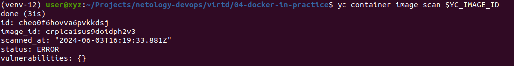
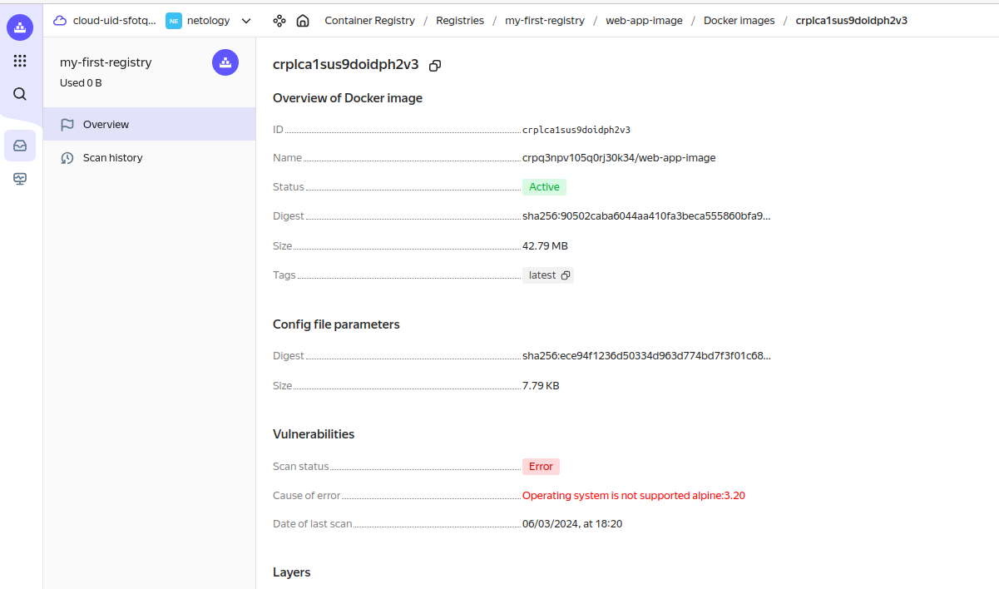
</details>

Сделал 2-ой stage тоже `python:3.9-slim`. YC image scanner обнаружил уязвимости уровня OS.

<details>
<summary>Скриншот</summary>

```bash
yc container image scan $YC_IMAGE_ID
yc container image list-vulnerabilities --scan-result-id ${...}
```
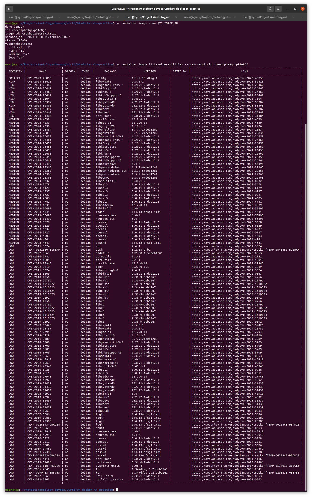
</details>

## Задание 3.


Запустить:

```bash
YC_REGISTRY=$(yc container registry list | grep -v + | cut -d '|' -f 2 | sed -e 's/\s//g' -ne '2p') \
DB_PASSWORD=$(sed -ne 's/MYSQL_PASSWORD="\(.*\)"/\1/p' shvirtd-example-python/.env) \
DB_USER=$(sed -ne 's/MYSQL_USER="\(.*\)"/\1/p' shvirtd-example-python/.env) \
DB_NAME=$(sed -ne 's/MYSQL_DATABASE="\(.*\)"/\1/p' shvirtd-example-python/.env) \
docker compose up -d
```

```bash
echo "SHOW DATABASES; USE virtd; 
SHOW TABLES; SELECT * FROM requests LIMIT 10;" \
| docker exec -i db mysql -uroot -pYtReWq4321
```
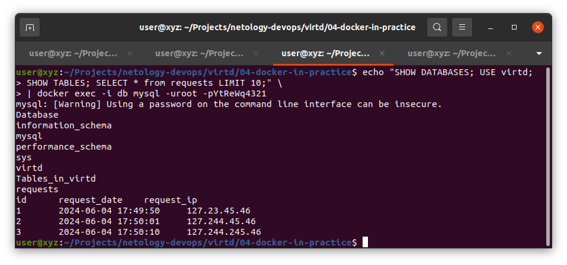

<details>
<summary>Скриншот в интерактивном формате</summary>

```bash
docker exec -it db mysql -uroot -pYtReWq4321
show databases;
use virtd;
show tables;
SELECT * from requests LIMIT 10;
```

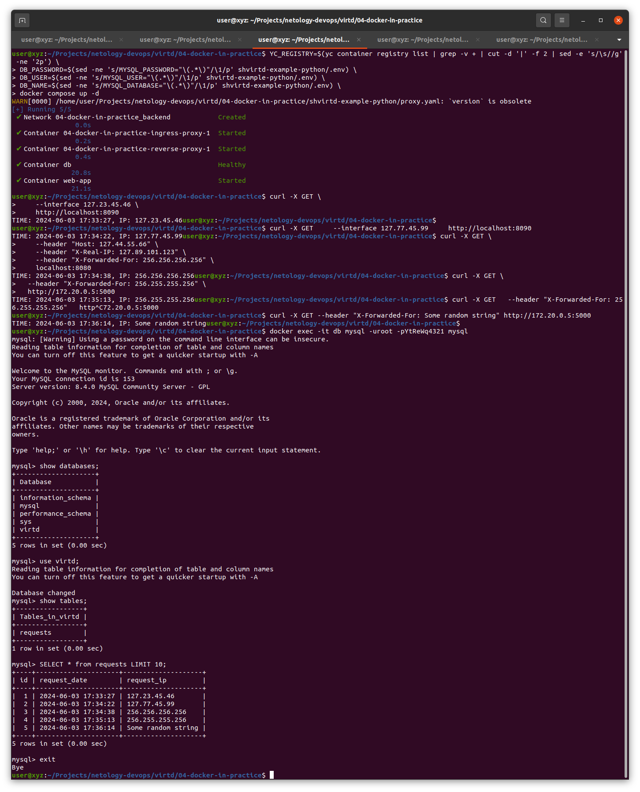
</details>

<details>
<summary>Troubleshooting + requests</summary>

Может возникнуть конфлик с уже существующей сетью:
```bash
# Error: failed to create network 04-docker-in-practice_backend: Error response from daemon: Pool overlaps with other one on this address space
docker network ls -q | xargs docker network inspect | jq '.[] | {Name, IPAM}'
docker network rm ${...}
# OR
ip route show # ip neigh
ip neigh show to 172.20.0.0/24
# OR troubleshoot with ip interface listings
ip -4 addr show type bridge
# OR all the interfaces
ip addr show
```

Проверить работу Nginx
```bash
curl -X GET http://127.23.45.46:8090

curl -X GET \
    --interface 127.23.45.46 \
    http://localhost:8090

curl -X GET \
    --interface 0.0.0.0 \
    http://localhost:8090

# For interface you can use any address in loopback CIDR range (127.0.0.0/8) + 0.0.0.0
```

Проверить работу HA Proxy
```bash
curl -X GET \
    --header "Host: 127.44.55.66" \
    --header "X-Real-IP: 127.89.101.123" \
    --header "X-Forwarded-For: 256.256.256.256" \
    localhost:8080
```

Убедиться, что `web-app` Flask приложение запущено:
```bash
docker logs web-app

# OR healthcheck command
curl -X OPTIONS http://172.20.0.5:5000
```

Проверить работу Python-скрипт
```bash
curl -X GET \
  --header "X-Forwarded-For: 256.255.255.256" \
  http://172.20.0.5:5000
```
</details>


## Задание 4.

TO DO: Remote context + 5th show sqldumps

<details>
<summary><h3>YC CLI VM</h3></summary>

```bash
NETWORK_NAME=cli-network
SUBNET_NAME=first-subnet
ZONE=ru-central1-b

yc vpc network create --name $NETWORK_NAME
yc vpc subnet create --name $SUBNET_NAME \
    --network-name $NETWORK_NAME \
    --zone $ZONE \
    --range 10.28.10.0/24

INSTANCE_NAME=cli-instance

# Show all standard images to select from
# yc compute image list --folder-id standard-images

yc compute instance create \
--name $INSTANCE_NAME \
--ssh-key ~/.ssh/yandex-vm.pub \
--preemptible \
--cores 2 \
--core-fraction 20 \
--memory 2 \
--platform standard-v3 \
--network-interface subnet-name=$SUBNET_NAME,nat-ip-version=ipv4 \
--create-boot-disk name="my-backed-disk",image-folder-id=standard-images,type=network-hdd,size=16,image-family="ubuntu-2204-lts"

# yc compute instance list

# Create IAM token for docker login to cr.yandex container registry
yc iam create-token

ssh yc-user@$IP_ADDRESS
```


```bash
# Within VM session
# Copy text + Ctrl+D
cat > task4_init.sh # ...
cat > task4.sh # ...
cat > task4_env.txt # ...


chmod +x task4_init.sh
chmod +x task4.sh
./task4_init.sh

# Need to relogin, so that docker group is in effect
logout

ssh yc-user@$IP_ADDRESS
./task4.sh
```

```bash
# clean up
yc compute instance delete --name $INSTANCE_NAME
yc vpc subnet delete --name $SUBNET_NAME
yc vpc network delete --name $NETWORK_NAME
```
</details>

Remote context:

```bash
docker context ls
docker context create yc-remote --docker "host=ssh://yc-user@84.201.163.139"
docker context ls
docker --context yc-remote ps
docker context use yc-remote
docker ps -a
echo "SHOW DATABASES; USE virtd; SHOW TABLES; SELECT * FROM requests;" | docker exec -i db mysql -uroot -pYtReWq4321
docker context use default
docker context remove yc-remote
```

Файлы:
* [task4_init.sh](./task4/task4_init.sh)
* [task4.sh](./task4/task4.sh)
* [task4_env.txt](./task4/task4_env.txt)

<details>
<summary><h3>Скриншоты</h3></summary>

* Образы скачаны успешно и загружены
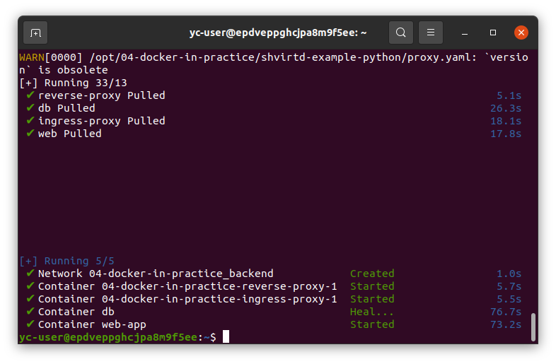
* При запуске `https://check-host.net/check-http`, т.к. web-app не расчитан на высокодоступность (High Availability), то постоянно падал – нужно было постоянно перезапускать.
<details>
<summary>Скриншоты запусков на сайте</summary>


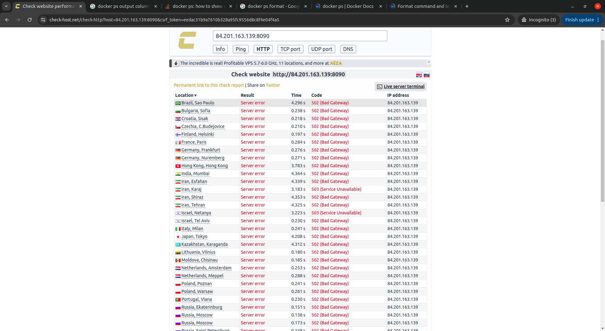
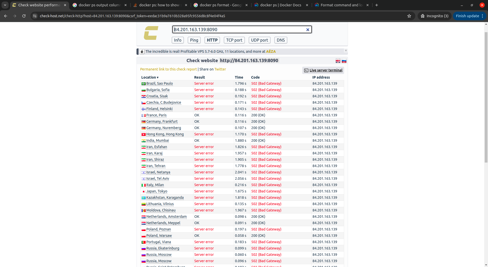
</details>

* Результат SQL-запроса
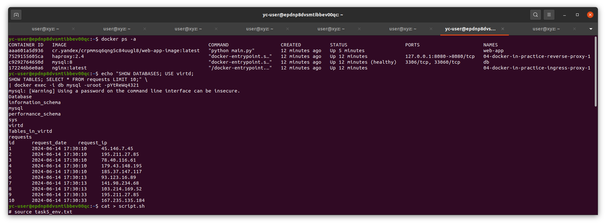
</details>

<details>
<summary><h3>Misc</h3></summary>

<details>
<summary>Non-admin IAM Token</summary>

```bash
yc resource-manager folder list
yc iam service-account create --name cr-yandex-reader
yc iam key create --folder-name netology --service-account-name cr-yandex-reader --output cr-reader-key.json
yc config profile create yc-registry-reader # -> yc-registry-reader
yc config set service-account-key cr-reader-key.json
yc config set folder-id ${FOLDER_ID}
yc config profile activate default
yc container registry add-access-binding --name my-first-registry \
    --service-account-name cr-yandex-reader \
    --role container-registry.images.puller
yc config profile activate yc-registry-reader
yc iam create-token
yc config profile activate default
```
```bash
# Clean up
yc config profile delete yc-registry-reader
yc iam service-account delete --name cr-yandex-reader
rm cr-reader-key.json
```
</details>

<details>
<summary>cURL</summary>

Если использовать cURL
```bash
# ....
sudo mkdir -p /opt/04-docker-in-practice/shvirtd-example-python
sudo chown -R yc-user:yc-user /opt/04-docker-in-practice/
cd /opt/04-docker-in-practice/shvirtd-example-python

curl -fsSL -O https://raw.githubusercontent.com/netology-code/shvirtd-example-python/main/{.env,main.py,proxy.yaml,requirements.txt}
mkdir -p haproxy/reverse nginx/ingress
curl -fsSL -O https://raw.githubusercontent.com/netology-code/shvirtd-example-python/main/haproxy/reverse/haproxy.cfg
mv haproxy.cfg haproxy/reverse
curl -fsSL -O https://raw.githubusercontent.com/netology-code/shvirtd-example-python/main/nginx/ingress/{default,nginx}.conf
# mv {default,nginx}.conf nginx/ingress № does not work in sh, only in bash
mv default.conf nginx/ingress
mv nginx.conf nginx/ingress

# go back to 04-docker-in-practice
cd ..
# download compose.yaml 
curl -fsSL -O https://raw.githubusercontent.com/$COMPOSE_PATH/compose.yaml
# ....
```
</details>
</details>

## Задание 5.

### Настройка MysqlDump

[--opt](https://dev.mysql.com/doc/refman/8.4/en/mysqldump.html#option_mysqldump_opt) По умолчанию включено, опущено в коде.


Ошибки:
> mysqldump: Got error: 1045: "Plugin caching_sha2_password could not be loaded: Error loading shared library /usr/lib/mariadb/plugin/caching_sha2_password.so: No such file or directory" when trying to connect

> ERROR 1524 (HY000): Plugin 'mysql_native_password' is not loaded

\
Согласно [документации](https://dev.mysql.com/doc/refman/8.4/en/sha256-pluggable-authentication.html) оба метода `mysql_native_password` и `sha256_password` deprecated.\
Однако, например, [MariaDB](https://mariadb.com/kb/en/authentication-plugin-sha-256/) до сих пор не поддерживает `caching_sha2_password`.
```bash
docker exec db "ls" "/usr/lib/mysql/plugins/"
# authentication_kerberos_client.so
# authentication_ldap_sasl_client.so
# authentication_oci_client.so
# authentication_webauthn_client.so
# -> No caching_sha2_password.so or sha256_password.so to copy
```
Нет caching_sha2_password.so или sha256_password.so чтобы скопировать – т.е. это не plugin'ы, только встроенные механизмы.

```bash
docker exec -it db mysql -uroot -pYtReWq4321 mysql
```
```sql
SELECT PLUGIN_NAME, PLUGIN_VERSION, PLUGIN_STATUS, PLUGIN_TYPE, PLUGIN_DESCRIPTION, LOAD_OPTION
FROM INFORMATION_SCHEMA.PLUGINS WHERE PLUGIN_TYPE = 'AUTHENTICATION';
```
<details>
<summary>Скриншот SQL</summary>

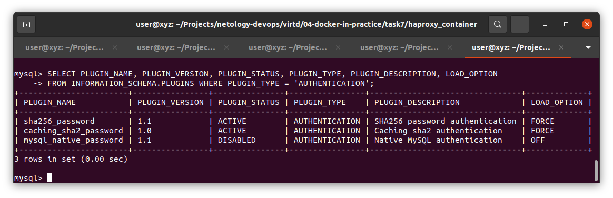
</details>

Не смог найти способа добавления caching_sha2_password для аутентификации. Пришлось воспользоваться `mysql-native-password`.\
Добавил в `compose.yaml` флаг включения `--mysql-native-password=ON` ([src](./compose.yaml#L21)) \

### Настройка Crond

Если смонтировать файл с описанием cron-job в место, где должны храниться cron-jobs
> -v $(pwd)/crontab:/var/spool/cron/crontabs/root

(Метод описан в документации)

То, работать не будет. Хотя, при выполнении команд показывает, что данная работа существует: \
* `docker exec -it schnitzler sh`
* `crontab -l`
    + > \* \* \* \* \* /usr/local/cron-job.sh ~~password~~ virtd

### Ответ

Запуск:
```bash
# Use Ctrl+D to finish input
cat > script.sh # ....
cat > task5.sh # ....
cat > task5_env.txt
TABLE_NAME=virtd
DUMPER_PASSWORD=...
MYSQL_ROOT_PASSWORD=...
# Ctrl+D

chmod +x task5.sh
./task5.sh
```

Файлы:
* [script.sh](./task5/script.sh)
* [task5.sh](./task5/task5.sh)

<details>
<summary>Ответ</summary>

Cron-job выполняется каждую минуту
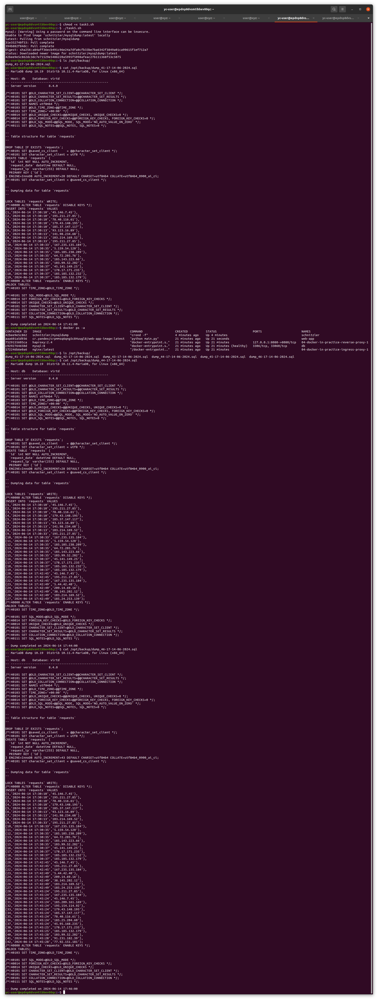
</details>


## Задание 6.

```bash
docker pull hashicorp/terraform:latest
```

### Задание 6.0
```bash
docker run -ti --rm  -v /var/run/docker.sock:/var/run/docker.sock wagoodman/dive hashicorp/terraform:latest

docker save hashicorp/terraform:latest -o terraform-image.tar
mkdir terraform-image && tar -xf terraform-image.tar -C terraform-image
cd terraform-image/blobs/sha256
mkdir layer && tar -xf ${layer-sha256-hash} -C layer
cd layer/bin
./terraform --version

cd ../../../../..
rm -rf terraform-image*
```
<details>
<summary>Скриншоты</summary>

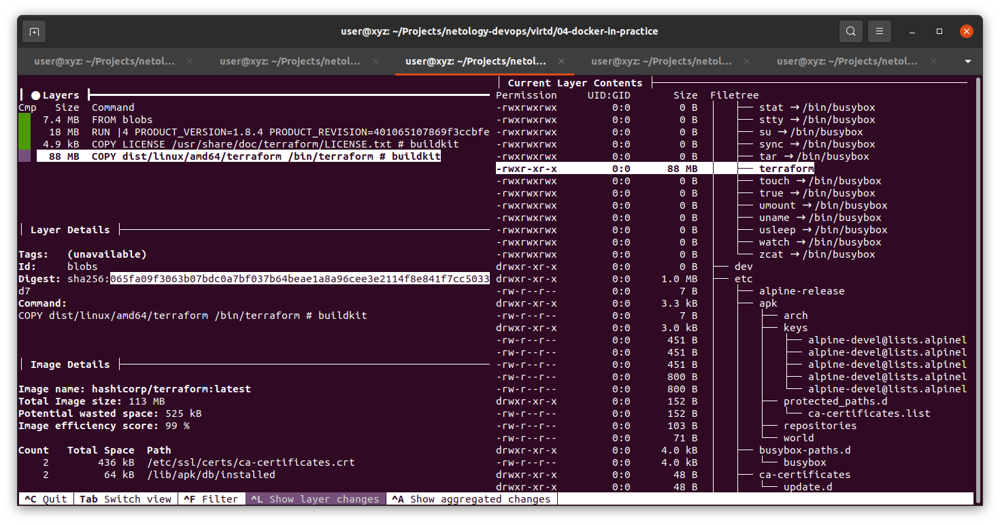
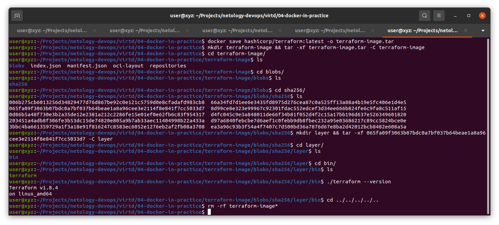
</details>

### Задание 6.1

```bash
docker run --name terraform hashicorp/terraform:latest --version
docker cp terraform:/bin/terraform .
find . -maxdepth 1 -type f -executable
./terraform --version
rm ./terraform
```

<details>
<summary>Скриншот</summary>

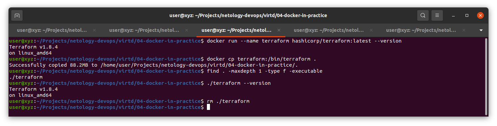
</details>

### Задание 6.2

[StackOverflow](https://stackoverflow.com/questions/33377022/how-to-copy-files-from-dockerfile-to-host) \
[Docs](https://docs.docker.com/reference/cli/docker/image/build/#output)

```bash
# DOCKER_BUILDKIT=1 is implied by default
docker build -f Dockerfile.terraform --output $(pwd) .
```

<details>
<summary>Скриншот</summary>

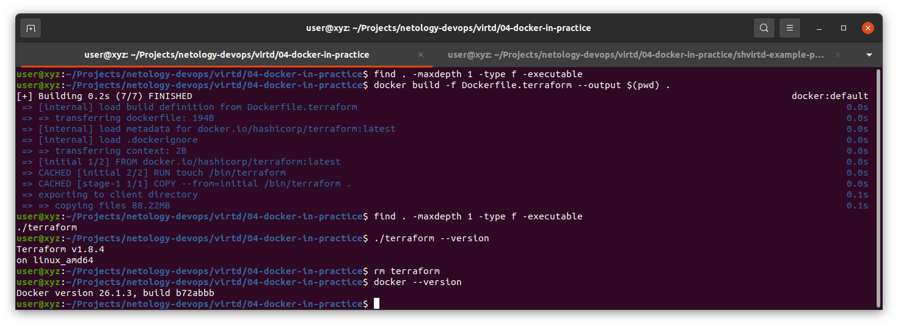
</details>

## Задание 7.

Будет добавлено в ближайшее время.


<details>
<summary><h3>Misc<h3></summary>

<details>
<summary>Skopeo inspect cr.yandex image</summary>

```bash
docker pull quay.io/skopeo/stable:latest

yc iam create-token

docker run -d --rm --name skopeo-inspect \
    --entrypoint="" \
    quay.io/skopeo/stable \
    sleep 5000
docker exec -it skopeo-inspect bash
skopeo login --debug \
    --username iam \
    --password ${IAM_TOKEN} \
    cr.yandex
skopeo inspect docker://cr.yandex/${REPOSITORY_ID}/${IMAGE_NAME±IMAGE_TAG}
```
</details>

</details>
